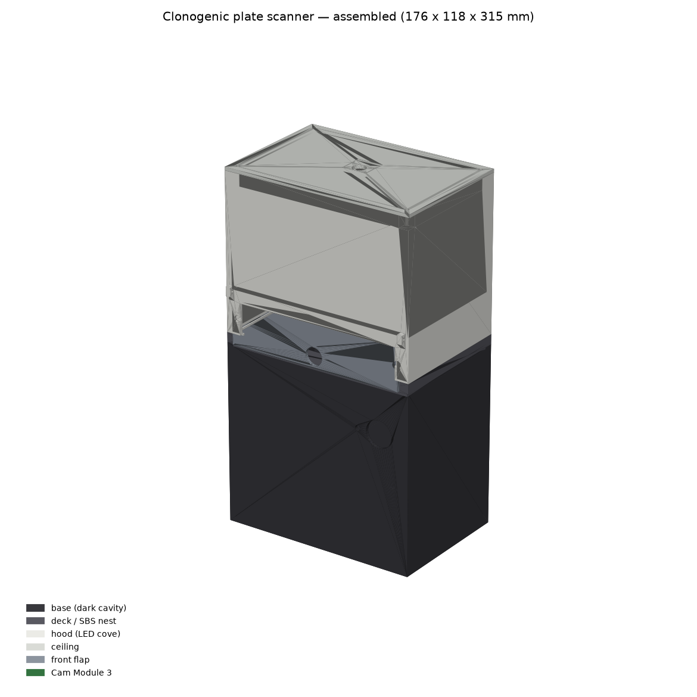
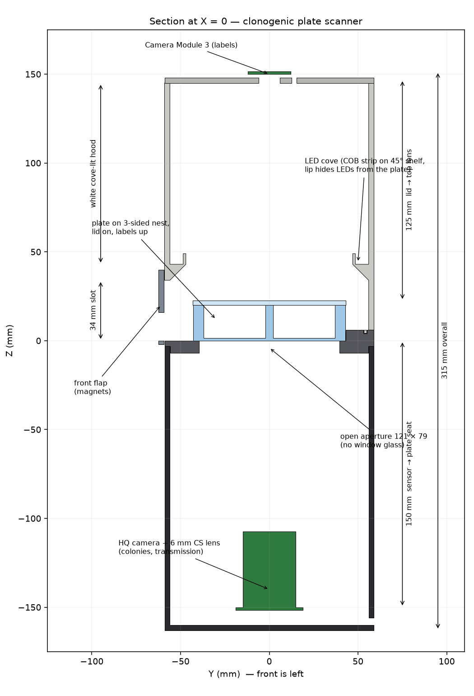

# Clonogenic 6-well plate scanner — design package

Designed 2026-09-09 with AnkusDrive (FreeCAD driven headless). A bench box you slide a
crystal-violet-stained 6-well plate into, lid on; it gives you a transmitted-light OD image of
every well, a photo of what you wrote on the lid, and a CSV of colony count / area / integrated
OD per well.

**Two builds.** `v2_flip/` — one camera on a light pad, you flip the plate between the label
shot and the colony shot; the current design is **rev 4.0 in `v2_flip/v21/`**: 3 prints, camera and Pi under the
tower's ceiling, a 2-inch display in the front wall, a plain button on the roof, parts ≈ $295, whole build ≈ $365 with the prints
(`v2_flip/BOM_v2.md`, `v2_flip/ORDER-SHEET.md`, `v2_flip/ASSEMBLY.md`, `v2_flip/OPERATION.md`).
**This is the one to build.** It connects to a Mac by Ethernet; the Mac runs the models. The rest of this
directory is variant A — two cameras, one press, 5 prints, ≈ $260 — kept in full because the
optics model, software, BOM and measurement list are shared.

## How it works (the three decisions that matter)

1. **The plate is imaged from BELOW, through an open aperture, with the lid ON.** A Raspberry Pi
   HQ Camera with a 6 mm lens sits 150 mm under the plate seat in a matte-black cavity and sees
   the well floors in transmission: 37.6 µm/px, 8 px across a 0.3 mm colony, ±10 mm depth of
   field at F5.6. Colonies are on the well floor, so this is the sharpest, most quantitative view
   and the lid never touches the optics.
2. **Marker ink on the lid does not corrupt the numbers.** The hood is an integrating box: a COB
   strip on a 45° cove shelf fires at a white ceiling; the plate sees a 2.2 sr diffuse source and no
   LED directly. Ink 20 mm above the colony plane casts a smooth shadow with a 30 mm penumbra —
   1 % dimming under a fine stroke, 12.6 % under a chisel-tip stroke across a well (`optics_model.py`).
   Because the image is illumination × transmission, the shadow is a smooth additive term in OD
   and a 3 mm grey-opening background removes it; colonies are 0.3–2 mm.
3. **A second camera reads the lid.** Camera Module 3 in the ceiling, 127 mm above the lid,
   166 × 95 mm field, 28 px/mm. The label photo is stored next to the data; OCR is optional.

Loading is a cassette: open the magnetic front flap, slide the plate along the runway until it
stops against the rear datum wall, drop the flap, press the button. The three-sided SBS nest
holds the plate to ±0.3 mm and the software refines each well centre to a pixel.

## Files

| File | |
|---|---|
| `build_scanner.py` | the whole geometry, parametric; run it in the AnkusDrive worker (`run_script`) |
| `base.stl` `deck.stl` `hood.stl` `ceiling.stl` `door.stl` | print files, in the frame of the model (Z up, plate seat Z = 0) |
| `colony_scanner_assembly.step`, `colony_scanner.FCStd` | full assembly with the reference plate and cameras |
| `render_*.png`, `section_x0.png` | assembled, cutaway, exploded, deck, dimensioned section |
| `optics_model.py` | pixel scale, DOF, ink-shadow, top-camera field, exposure budget; every constant sourced |
| `BOM.md` | parts and prices; print settings and orientations |
| `PLATE-COMPATIBILITY.md` | the lab's CELLTREAT 229105 checked item-by-item against the design, plus six other brands and the Pi camera drawings |
| `refs/` | the manufacturer PDFs those numbers came from (CELLTREAT, TPP, Eppendorf, SPL, Raspberry Pi) |
| `MEASUREMENTS-REQUIRED.md` | the few numbers still worth a caliper (height with lid, skirt rim width) |
| `scanner_sw/` | Pi software: `capture.py` (button → raw frames → quantify), `quantify.py`, `calibrate.py`, `config.yaml` |
| `synthetic_overlay.png` | `quantify.py` run on a synthetic plate (mis-seated, marker-shadowed) |

## Build order

1. Print the **deck** and check `MEASUREMENTS-REQUIRED.md` M1–M3, M9 with a real plate.
2. Print base, hood, ceiling, door. Line the base cavity with black flock if you have it.
3. Base: HQ camera on the four floor bosses (lens up), ribbon out through the floor-level rear
   slot; Pi on the rear wall on 11 mm standoffs; arcade button in the front hole.
4. Hood: stick the COB strip on the cove shelf (LEDs up), wire out through the rear hole to the
   MOSFET; Camera Module 3 on top of the ceiling over the Ø12 hole on 2 mm spacers; ceiling on
   the four corner bosses; door on two 12 mm filament pins; magnets in the door and wall pockets.
5. Deck on the base (spigot locates it), hood on the deck (tongue in groove).
6. Software: `sudo apt install python3-picamera2 python3-gpiozero`, `pip install -r requirements.txt`,
   copy `scanner.service` to `/etc/systemd/system/`, enable.
7. Calibrate once: scan an **empty plate with lid** → `calibrate.py` (writes px/mm, rotation,
   centre into `config.yaml`) → `capture.py --flat` with the same plate → `capture.py --dark`.
8. Scan.

## What you get per scan

`bottom_raw_stack.npy` (all frames, unfiltered, 12-bit linear), `top_labels.jpg`, `od.npy`,
`overlay.png`, `colonies.csv` (well, x, y, area, diameter, integrated OD), `wells.csv`, and a
run-record JSON with git SHA + config. Surviving fraction is then a join of `wells.csv` with your
seeding sheet; the labels photo tells you which well was which.

## Quantitation caveats, honestly

- Integrated OD ∝ bound dye ∝ cell number only within a well's linear range; saturated (OD > 1.5)
  colony centres clip. Stain lighter rather than darker.
- The colony-size cut (`min_colony_diameter_mm`, 0.3) is a proxy for "≥ 50 cells"; set it per cell
  line by eye on the first plates, then never touch it again (it is in the run-record).
- Touching colonies are split by a watershed; heavily confluent wells should be reported as area
  fraction, not count.
- The 6 mm lens has a few percent barrel distortion; `calibrate.py` fits a similarity transform
  only. Good enough for ±0.3 mm well positions; if you want sub-pixel colony positions across the
  whole plate, add a dot-grid target and a radial term.

## Alternatives considered

- **Flatbed scanner (Epson V600, ~$280).** The classic approach; quantitatively fine. Loses:
  the lid labels (plate goes face-down without the lid), the fixed nest (well finding is
  per-scan), and the one-button flow. Chosen against for those three reasons, not for image quality.
- **Single top camera, lid on.** Ink physically overlays colonies; unrecoverable. Rejected.
- **Hinged hood.** Cables move, and a 140 mm hood will not stay open by gravity below ~130°.
  The front slot keeps every cable static.
