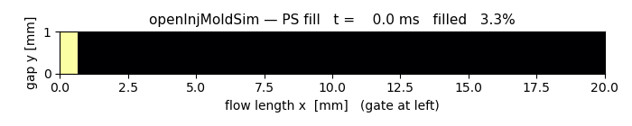
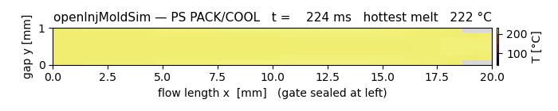

# Injection-molding fill solver (issue #105)

The higher-fidelity twin of the `molding_screen` correlation: a real two-phase
(melt + air) flow solve that answers *"can this geometry actually be molded?"* —
**short-shot / fill ability** (the strongest, most reliable gate), fill time, and a
peak injection-pressure proxy.

## Two backends, one tool — `molding_fill_submit`

| | headline solver | runnable today | physics | validation |
|---|---|---|---|---|
| **openInjMoldSim** | yes (issue target) | **YES — built, case-gen + worker wired, validated** (2026-06-22; see below) | compressibleInterFoam + Cross-WLF + Tait; fill (pack/cool scaffolded) | peer-reviewed (MDPI Fluids 5(2):84, 2020) |
| **interFoam VOF** (fallback) | — | **yes**, on the existing OpenFOAM (.com/ESI) | incompressible VOF, Newtonian or BirdCarreau melt; fill only | we own the case + gate |

`molding_fill_submit` now **generates and runs openInjMoldSim** whenever its binary
resolves (`solvers.openinjmoldsim_bin()`) — building the OF7-org case from the
cavity + process params (or running a prepared `case_dir` if one is supplied). It
falls back to building and running the **interFoam** 2-D plaque-cavity fill case on
the existing OpenFOAM only when the OF7 build is absent (or an explicit `application`
forces it). The GPL solver is held at the subprocess boundary — never imported into
Python — the same arm's-length posture as the Elmer/OpenFOAM/YADE/openEMS/preCICE
binaries.

### Why the fallback still exists

openInjMoldSim targets **OpenFOAM 7 (.org / openfoam.org)**; this host also builds
OpenFOAM **v19xx/v25xx (.com / ESI)**. The forks are not drop-in compatible, so the
headline path needs a **parallel OpenFOAM-7 build** (`tools/build_openinjmoldsim.sh`,
a multi-hour host-heavy compile — now done on this host). Where that build is absent,
the interFoam fallback needs **no new build**, runs on the existing solver in ~2 s
for a coarse 2-D case, and still answers the single most reliable molding question
(short-shot). It loses the packing/cooling stage and the published IM validation;
those ride on the OF7 path, which is now the default wherever the build is present.

## The interFoam fill case (`ankusdrive/analysis/molding_fill.py`)

A **2-D rectangular plaque cavity** (`length` × `wall_thickness`, one cell deep,
`empty` front/back). The gate is a short inlet patch at the bottom of the left edge;
**vents** sit at the far (right) corners so the displaced air has somewhere to exit
— without a vent the incompressible VOF cannot fill and the front stalls spuriously.
The cavity starts full of air (`alpha.melt = 0`); melt is injected at a fixed mean
velocity (from the volumetric rate / gate area), and `interFoam` tracks the
`alpha = 0.5` melt front. Melt viscosity is Newtonian by default, or **BirdCarreau**
(`carreau={nu0,nuInf,k,n}`) as the shear-thinning stand-in for openInjMoldSim's
Cross-WLF.

Fields are read straight from the final `alpha.melt` (no function-object writers —
`surfaceFieldValue` is sha1-broken in this build, same reason `openfoam.py` reads
`p` directly):

- `filled_fraction` — mean alpha over the cavity (1.0 = full, < 1 = short shot).
- `front_x_frac` — furthest axial column at least half full (how far the front got).
- `last_to_fill_x_frac` — least-filled column (where a short shot starves).
- `max_pressure_pa` — max of the converged pressure field (peak-injection proxy).

## The moldability gate (`fill_gate`)

Returns the house verdict shape:

```
{ pass, score, fidelity:"solve", band_pct:20.0,
  filled_fraction, short_shot, last_to_fill_x_frac, front_x_frac,
  max_pressure_pa, pressure_ok, fill_time_s, warnings }
```

`pass` is true when the cavity is essentially full (`filled_fraction ≥ 0.97`, no
short shot) **and** the peak pressure is within the machine limit (default 180 MPa).
`fidelity="solve"` (a real VOF fill, not a correlation); `band_pct=20` reflects the
case-setup-owned validation. This is the `escalate_to` target of `molding_screen`
(set whenever the screen's fill check runs).

## Validation (`tests/test_molding_fill.py`)

Skip-guarded like the other solver tests. The solver-backed half builds two real
cavities and runs blockMesh + interFoam:

- **fillable** (50 mm × 2 mm, 0.4 s): the front reaches the far end
  (`front_x_frac ≈ 1.0`, ~99 % filled) → `pass=True`.
- **short shot** (200 mm × 1.5 mm, viscous melt, 0.12 s): the front stalls at
  ~13 % of the flow length → `pass=False, short_shot=True`.

Both ran on the host's OpenFOAM v2512 (`interFoam` resolves via the sourced bashrc).

## openInjMoldSim — BUILT & VALIDATED (2026-06-22)

The parallel OpenFOAM-7 (.org) stack is built and the solver runs. Steps that worked
on this host (Ubuntu 24.04, gcc 13.3):

1. **OpenFOAM-7 (.org)** — `ThirdParty-7` (scotch) then `OpenFOAM-7` (`version-7`
   branch) under `~/OpenFOAM/`. **Compiles clean on gcc-13** with no patching — the
   `version-7` branch already absorbed the modern-toolchain fixes (~24 min at `-j8`).
2. **openInjMoldSim v7.2** — cloned to `~/opt/openInjMoldSim`, built via
   `applications/solvers/multiphase/openInjMoldSim/Allwmake` against the sourced OF7
   `etc/bashrc`. Binaries `openInjMoldSim`/`openInjMoldSimF` land in `$FOAM_USER_APPBIN`.
3. `solvers.openinjmoldsim_bin()` **auto-resolves** the binary via its
   `~/OpenFOAM/*/platforms/*/bin` glob — `ANKUSDRIVE_OPENINJMOLDSIM*` env vars are
   optional, not required.
4. **Validated** on the bundled `tutorials/demo/fill_pack` (9600 cells), serial,
   `-fillEnd 0.98` → *"Filled to 0.98005119 and terminating"* (~9.5 min). The full
   Cross-WLF + Tait fill physics runs; `foamToVTK -latestTime -ascii` → meshio reads
   the result (20434 pts) — the same extraction path the worker uses.

> `tools/build_openinjmoldsim.sh --build` automates steps 1–2 (capped `-j8`, ccache).

### Case-prep gotchas (REQUIRED for any openInjMoldSim case on this host)

The OSHA1stream SHA1 path is broken in this toolchain (same breakage noted for the
ESI build's functionObjects). Two consequences when preparing a case:

- **Inline every `#calc` / `#codeStream` directive** — OpenFOAM's on-the-fly code
  compilation SHA1-hashes the generated snippet and aborts. e.g. the tutorial's
  `constant/solidificationProperties` had `viscLimEl #calc "$etaMax*0.5"`; replace
  with the literal (`viscLimEl 5e6;`).
- **Emit no `functions{}` functionObject block** in `controlDict` (the tutorial ships
  a `probes`/`libsampling.so` sampler) — its SHA1 write aborts the run at *"Starting
  time loop"*.

The worker generates cases programmatically, so it simply emits neither.

## Programmatic OF7 case generation — DONE & VALIDATED (2026-06-22)

`molding_fill.py` now generates a complete, runnable **OF7-org openInjMoldSim** case
(`openinjmoldsim_case_files` / `write_openinjmoldsim_case`), and `molding_fill_submit`
**runs that headline GPL solver** whenever its binary resolves — no prepared
`case_dir` needed. The interFoam path is now only the fallback for when the OF7 build
is absent (or when an explicit `application` is passed).

The generated case is a **pressure-driven, non-isothermal** 2-D plaque fill (the way
a real press is controlled): melt enters hot at the gate against an injection-pressure
ramp, the y=0/y=H mold walls draw heat out, and the **Cross-WLF** viscosity climbs as
the melt cools — so a too-thin/long/cold cavity freezes off (a real short shot), not
just a kinematic one. The melt phase is `alpha.poly`; the **2-domain Tait** EOS gives
the compressible PVT behaviour. The Cross-WLF + Tait coefficients are pulled straight
from the **#106 materials corpus** (`materials.get(resin)['cross_wlf'|'tait_pvt']`) —
this is the path that actually consumes that corpus — falling back to tutorial-proven
PS coefficients for resins the corpus does not card.

### Toy validation (the green run)

`tools/openinjmoldsim_toy.py` generates → runs → parses → renders end-to-end:

```bash
python3 tools/openinjmoldsim_toy.py        # → build/oims_toy/{case, fill.gif}
```

A PS, 20 mm × 1 mm plaque (60×8 cells) **filled to 0.98005 and terminated**
(`-fillEnd 0.98`, ~3 min serial); the gate returns `pass=True, fidelity="solve"`,
`front_x_frac=1.0`, peak ≈ the 2 MPa inlet. The melt front advancing gate→far-end:



(filmstrip: `artifacts/openinjmoldsim_fill_filmstrip.png` — 3.3 % → 27 % → 61 % →
86 % → 98 %.) The same generate-and-run path is covered by
`tests/test_molding_fill.py::test_openinjmoldsim_generated_case_fills` (skips unless
the OF7 build is present).

### Three more case-prep gotchas the generator handles

Beyond the two SHA1 gotchas above, the **violent compressible fill** is numerically
touchy. The advancing melt front opens a low-pressure region that pins to `pMin` and
sets the PIMPLE outer correctors oscillating (U → 100s of m/s within a single step →
`nan`). Three knobs, baked into the generator's defaults, keep it converged:

1. **Small `maxDeltaT`** (3 µs). A large cap lets `deltaT` grow during the quiescent
   pressure ramp; then the first fast-flow step is far too big and diverges *within*
   the step before `adjustTimeStep` can react. This was *the* fix.
2. **Low `maxCo`** (0.05) and **under-relaxed non-final PIMPLE iterations**
   (`p_rgh` 0.3, `U` 0.5; the `*Final` iterations stay 1.0 for time-accuracy).
3. **`FOAM_SIGFPE` unset before the run.** This build's `etc/bashrc` *exports*
   `FOAM_SIGFPE` (and even an empty value counts as "set"), so the FPE trap is on by
   default and aborts on the transient `exp` infinities the fill startup throws.
   Unsetting it lets the `etaMax`/`pMin` clamps recover the step. The worker's
   `_run_foam(..., unset_sigfpe=True)` and `tools/openinjmoldsim_toy.py` both do this.

One physics caveat: keep `mold_temp_k` **above** the Cross-WLF singularity `D2 − A2`
(~321 K / 48 °C for corpus PS) or near-wall cells cool through it. The default wall is
near-adiabatic (`wall_h_w_m2k=1`) for a clean fill demo; raise it (with a safe mold
temp) to model freeze-off short shots.

## Packing / cooling stage (issue #113, Part A)

Set `stages="fill_pack"` on `molding_fill_submit` (openInjMoldSim path) to run the
**packing/cooling continuation** after the fill: once the cavity is full, the worker
**seals the gate, switches the walls to cooling, and holds** while the part cools — the
stage that gives volumetric shrinkage, sink risk, residual pressure, and cooling time.

It is a *continuation* of the same case from the filled state (`startFrom latestTime`),
mirroring the tutorial's `close_outlet` + pack phases but serial. Per the tutorial
mechanics (`molding_fill.py` helpers): reset the restart `deltaT`, `set_walls_h_cmd`
(switch on cooling — the fill runs ~isothermal/near-adiabatic so it completes hot/fast,
then heat is extracted during the hold), `close_outlet_cmds` (seal: `p_rgh`→
`fixedFluxPressure`, `U`→`fixedValue (0 0 0)`, `T` outlet `h`←walls), then per phase
`time_extend_cmds` + re-run. Demo:

```bash
python3 tools/openinjmoldsim_toy.py --pack --cool-window-s 1.2   # → pack_cool.gif
```



**Two pack-specific gotchas** (beyond the five fill ones):

1. **Elastic-stress (`elSigDev`) divergence.** As the part cools past `viscLimEl` the
   elastic shear-stress model activates and, on this coarse constant-cp/kappa case, goes
   violently unstable (max U → 1e8, nan). Part A doesn't need elasticity, so the
   generator's **`elastic=False`** default sets `viscLimEl` *above* `etaMax` to disable
   it. `elastic=True` (the tutorial's behaviour) is reserved for the future
   residual-stress / warpage path and will need its own stabilisation.
2. **Conduction-limited cooling.** A 1 mm wall cools in ~10 s (Biot ≈ 7), so a short toy
   window gives *partial* cooling — `frozen_fraction` low, `cooling_time_s` a lower bound
   (the parser flags this). Use a thinner wall (0.4–0.5 mm) and/or a longer window
   (the tutorial runs to 6 s) for a fully-frozen cycle.

**The packing gate** (`pack_gate`) — verdict shape with `fidelity="solve"`:

- **`pass` is driven by sink risk** — a local under-packed region
  (`rho_min < 0.92 · rho_mean_final`, measured against the part's own mean). This is the
  actionable moldability signal; no dubious external reference.
- **shrinkage is a Tait-EOS faithfulness check, not a verdict.** The solved
  `volumetric_shrinkage_pct` (= `1 − ρ_fill/ρ_final`) is *raw PVT densification on
  cooling*, **not** the net "mold shrinkage" molders quote (which is
  post-packing-feed-compensation — that needs feed modelling, deferred). The gate checks
  it against the resin's own 2-domain Tait EOS (`tait_density` /
  `tait_densification_pct`): a wild solved/expected ratio *warns* (likely a heterogeneous
  fill-end state or too-coarse mesh) but does **not** fail. Validated: solved 3.70% vs
  Tait-expected 4.03% (493.8 → 420 K @ 2 MPa) → `pvt_faithful=true`, `pass=true`.

### Net mold shrinkage — the cavity-sizing number (issue #116)

The raw PVT densification above is **not** the net "mold shrinkage" molders quote on a
resin card (PS 0.4–0.7 %, HDPE 1.5–4.0 % *linear*). That number is *post-packing-feed*:
while the gate is open the melt is fed at the hold pressure to **make up** the volume lost
as it densifies, so only the densification *after the gate freezes* is uncompensated and
becomes net dimensional shrinkage. `molding_fill.net_mold_shrinkage` models exactly this:

- The gate seals when the melt at the gate reaches the **no-flow / PVT transition**
  temperature `Tt = b5 + b6·p` (the same melt/solid switch the Tait EOS uses).
- Net volumetric shrinkage `S_vol = 1 − ρ(T_gate_freeze, p_hold) / ρ(T_room, p_atm)`
  (cavity packed full and dense at gate freeze vs. the free cold part), evaluated on the
  **melt side** of the transition so the crystallization volume jump (large for HDPE,
  ~nil for amorphous PS) is counted as uncompensated — which is *why* semicrystallines
  shrink so much. Linear `S_lin = 1 − (1 − S_vol)^(1/3)` (isotropic), the form cards quote.
- It reports `raw_vol_pct` (the un-fed melt→room upper bound) and `compensated_vol_pct`
  (what the feed makes up) for transparency.

`mold_shrinkage_gate` is the **cavity-sizing verdict**, kept *distinct* from `pack_gate`:
**`pass` = the modelled `net_linear_pct` lands inside the resin's corpus
`mold_shrinkage_pct` band**. Below band → over-packed (cavity allowance too small, parts
run large); above band → under-packed (allowance too large, parts run small / risk sink).
This is the verdict the #104 CTE screen approximates. The hand-off is automatic: the
`fill_pack` result carries `net_shrinkage:{net_linear_pct, net_vol_pct, raw_vol_pct,
compensated_vol_pct, gate_freeze_temp_k}` and `shrinkage_gate:{pass, score, in_band,
corpus_band_pct, warnings}`. `hold_pressure_pa` (default = the ramp peak — the molder's
shrinkage lever: more packing → less shrinkage) and `room_temp_c` are exposed. Validated
(no-solver oracle): corpus PS → 0.49 % and HDPE → 2.33 % linear at 10 MPa hold, both
in-band.

## Warpage / residual distortion — `molding_warpage_submit` (issue #113 Part B)

There is no purpose-built open-source injection-molding warpage solver, so we take the
realistic loose-coupling path the issue scopes (mirroring the preCICE OpenFOAM↔CalculiX
FSI pattern): hand the **frozen-in differential cooling** from the part to **CalculiX
(`ccx`)** as a **thermo-elastic free-distortion** solve. Lives in
`ankusdrive/analysis/warpage.py`; surfaced as the async MCP tool `molding_warpage_submit`
(worker `_molding_warpage_submit`); the GPL `ccx` is held at the subprocess boundary
(its own deck is written and run — never imported), like every other heavy solver here.

**The physics.** A moulding shrinks as it cools (CTE α). *Uniform* shrinkage only makes
the part smaller; **differential** shrinkage warps it. The dominant driver is an
**asymmetric through-thickness** temperature field at ejection (an unbalanced cooling
layout, one mould half hotter, a rib on one face). That free thermal strain
`ε_th = α·(T − T_ref)` is non-uniform across the part; solving the *free* (rigid-body-
constrained only) linear-elastic problem with that eigenstrain gives the out-of-plane
distortion. A balanced part returns ~0; that contrast is the gate.

**How it runs.** Gmsh meshes the FreeCAD `body` on the main thread (2nd-order C3D10
tets, serial for reproducibility) and exports CalculiX cards; the worker writes a flat
`.inp` deck — `*ELASTIC` + `*EXPANSION,ZERO=T_ref`, a per-node `*TEMPERATURE` field (the
frozen-in cooling, here a linear through-thickness `dT_through_k`), a statically-
determinate **3-2-1** `*BOUNDARY` (three corner nodes remove the six rigid-body modes
while leaving the part free to expand and warp), `*STATIC`, `*NODE FILE U` — and runs
`ccx`. The `.frd` displacement field is reduced to the peak out-of-plane warp.

**The analytic twin (the oracle).** `free_plate_thermal_bow` gives the closed-form free-
plate result: a linear through-thickness ΔT bends a plate to uniform curvature
`κ = α·ΔT/h`, sagitta `δ = κ·L²/8`. The solve is gated against it (`warp_faithful`): a
thin-plate idealisation, so a few-percent-to-~50 % spread is expected; an order-of-
magnitude miss flags a bad mesh/field. Validated `artifacts/molding_warpage_bow.png`
(`tools/warpage_toy.py`): a 60×12×1.2 mm plate at ΔT=120 K bows to **3.07 mm vs the
3.15 mm twin** and tracks the curve along the whole span, while ΔT=0 stays **dead flat
(0.000 mm)**.

**The warpage gate** (`warpage_gate`) — verdict shape, `fidelity="solve"`:

- **`pass` is driven by flatness** — `max_warp_mm` vs `flatness_tol_mm` (or
  `flatness_tol_frac·span`, default 0.2 % of span, a typical plastic-part flatness call-
  out). `score = 1 − warp/tol` clamped.
- **`warp_faithful`** cross-checks the solved warp against the analytic twin (a warning,
  not a verdict).
- **Honest `band_pct` (40 %).** This is a **one-way, linear-elastic, loose coupling**: it
  ignores viscoelastic stress relaxation during cooling, flow-induced anisotropy / fibre
  orientation, the packing-pressure residual, and solidification path dependence. It
  captures the *dominant* differential-shrinkage warp **and its direction**, not a
  calibrated absolute. The corpus rheology cards carry no structural props, so E/ν/CTE
  fall back to solidified-resin defaults (with a warning) unless given — another reason
  to read the band.

**Two warpage gotchas:**
1. **Through-thickness resolution.** A strong linear gradient needs ≳4 element layers
   through the wall to bend correctly — a coarse 2-layer hex under-predicts the curvature
   ~20 % (C3D8I), 4 layers land within ~3 %. The worker's 2nd-order C3D10 tets are
   forgiving; the toy's hex mesh uses `nz=4`.
2. **The 3-2-1 pins the out-of-plane dof at *both* span-end corners** (A fully, B in
   thickness), so the solved bow is referenced to that chord — a sagitta peaking at
   mid-span (κ·L²/8), not a cantilever arc from one end. The artifact's analytic overlay
   matches that chord reference.

**Coupled cooling → warpage hand-off (issue #116).** Instead of hand-passing
`dT_through_k`, give `molding_warpage_submit` the Part-A cooling case
(`cooling_case_dir` + `cooling_nx`/`cooling_ny`): the worker reads that solve's
cell-centre `T` field, averages it into through-thickness (y) layers, and reduces the
profile to its **antisymmetric (bending) component** via
`molding_fill.cooling_field_dT_through_k` — a least-squares fit `T(ξ) ≈ a + b·ξ` over the
layer centres whose slope isolates the bending eigenstrain (the symmetric part, which only
shrinks the part uniformly, drops out). That effective `dT_through_k` feeds straight into
the same ccx eigenstrain / `free_plate_thermal_bow` twin. A `fill_pack` result also
reports `cooling_dT_through_k` directly for convenience; the warpage result reports
`dT_through_k` and `dT_source` (`input` vs `cooling_field@<time>`).

**Asymmetric per-wall cooling — making the live hand-off bite (issue #134).** The default
plaque fuses the y=0 and y=H mold faces into one `walls` patch cooled at a single `h`, so a
symmetrically-cooled plaque has *no* antisymmetric component and `cooling_dT_through_k ≈ 0`
(correct — a symmetric cool doesn't warp). To exercise the coupling end-to-end, pass
**different** per-wall coefficients `pack_wall_h_low_w_m2k` / `pack_wall_h_high_w_m2k` to
`molding_fill_submit`: the generator meshes the faces as split `wallLow` (y=0) / `wallHigh`
(y=H) patches (`openinjmoldsim_case_files(split_walls=…)` /
`_plaque_blockmeshdict(split_walls=…)`), and the pack stage sets each face's `h` separately
via `set_wall_h_cmd(time_dir, patch, h)`. The unequal cooling freezes a real through-thickness
gradient; the part bows toward the **slower-cooled (lower-`h`, hotter, last-to-freeze)** face,
and the result adds `asymmetric_cooling:{pack_wall_h_low_w_m2k, pack_wall_h_high_w_m2k,
warps_toward}` with a clearly nonzero `cooling_dT_through_k`. Leaving both unset (or equal)
is byte-identical to the pre-#134 fused-`walls` case, so the validated fill golden is
untouched. The live two-sided test (`tests/test_molding_fill.py`): asymmetric cool →
`dT_through_k > 0.5 K` toward the low-`h` face; symmetric cool → `|dT_through_k| < 0.5 K`.

**Still deferred — tracked in #116:** first-class weld-line / air-trap labels on the fill
result, and the viscoelastic residual-stress path (openInjMoldSim `elastic=True`
stabilised — it still diverges on cooling, max U → 1e8).
