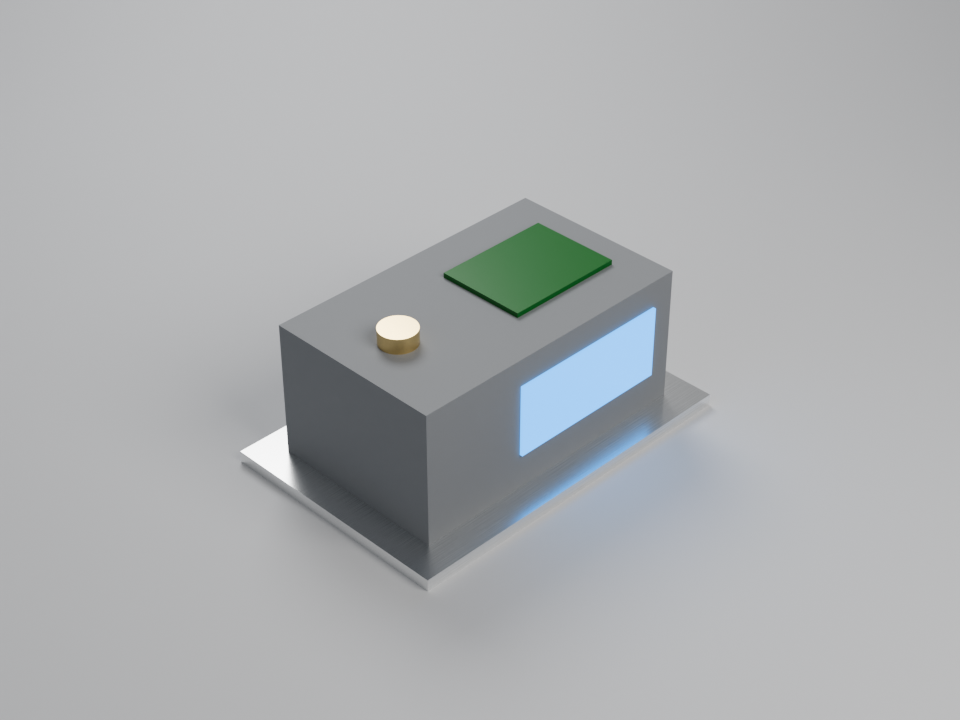

# Rendering in AnkusDrive — support, installation & limitations

AnkusDrive has **two** render paths. This guide covers which renderers are supported,
how to install them, how to confirm they work, and the known limitations.

- **Fast preview** — `render_view` / `render_views`: a host-side software rasterizer
  ([`ankusdrive/render.py`](../ankusdrive/render.py), NumPy + Pillow). Deterministic, no
  external dependencies, flat shading. The right tool for "can the agent *see* what it
  built." Nothing to install beyond `Pillow`/`numpy` (regular pip deps).
- **Photoreal** — `render_photoreal` (+ async `render_photoreal_submit` / `render_job`):
  materials, lighting, global illumination, perspective. Two backends behind one tool:
  - **Blender (recommended)** — full Blender run headless
    (`blender --background --python ankusdrive/blender_scene.py`). Renders whole
    **assemblies with per-part appearance** in a **studio scene** (seamless cyclorama,
    soft key/fill/rim area lights, contact shadows), Cycles + OIDN denoise, GPU when
    present, and saves the `.blend`. One install on every OS (§3, issue #335).
  - **FreeCAD Render add-on renderers** — the third-party
    [FreeCAD Render workbench](https://github.com/FreeCAD/FreeCAD-render) shelling out to
    POV-Ray / LuxCore / Appleseed / standalone Cycles / OSPRay / pbrt: one shape, one
    library card, each renderer's stock lighting template. Requires the addon **and** a
    renderer binary.

`renderer="auto"` (the default) uses Blender when it resolves and falls back to POV-Ray
(then any other add-on renderer), naming the renderer it used and — when it fell back —
handing the agent the Blender install command as a `suggestion`.

For design/architecture see [`RENDER_WORKBENCH.md`](RENDER_WORKBENCH.md); for the
provisioning detail and pinned download checksums see
[`RENDER_RENDERER_INSTALL.md`](RENDER_RENDERER_INSTALL.md).

---

## 1. Renderer support matrix

`render_photoreal(handle | parts, renderer="…")` — `"auto"` is the default: **Blender**
when it resolves, else **POV-Ray**, else any add-on renderer that resolves. The table
is about whether a usable **binary** is obtainable.

| `renderer=` | Status | How to get it | Assemblies · per-part appearance · studio scene · `.blend` |
|---|---|---|---|
| **`Blender`**    | ✅ works (preferred by `auto`) | Linux `scripts/install-renderers.sh blender` or `snap install blender --classic` · macOS `brew install --cask blender` · Windows `scripts/install-solvers.ps1 blender` or `winget install BlenderFoundation.Blender` | ✅ · ✅ · ✅ · ✅ — Blender **4.2+** (5.2 LTS pinned). No Render add-on needed. |
| **`Povray`**     | ✅ works (`auto` fallback) | `apt install povray` · `brew install povray` · Windows installer | Assembly fused to one shape, one card, stock template. Fast; lower ceiling. |
| **`Luxcore`**    | ✅ works | `scripts/install-renderers.sh` (LuxCore **v2.6 SDK**) | One shape/card. Highest add-on quality + PBR; needs the `-sdk` build (`luxcoreconsole`). |
| **`Appleseed`**  | ✅ works (one material caveat — §6) | `scripts/install-renderers.sh` (Appleseed **2.1.0-beta**, 2019 final build) | One shape/card. Console renderer `appleseed.cli`. |
| **`Cycles`**     | ✅ works | `scripts/build-renderers.sh cycles` (CPU standalone, built against system libs) | One shape/card. The **stripped standalone** Cycles (no OIDN/OSL/GPU, Linux only) — for Cycles quality use `Blender`. |
| **`Ospray`**     | ⚠️ builds + renders, but dim | `scripts/build-renderers.sh ospray` (OSPRay Studio vs the OSPRay 3.2.0 SDK) | One shape/card. Low-contrast on the stock template — see §6. |
| **`Pbrt`**       | ✅ works | `scripts/build-renderers.sh pbrt` ([mmp/pbrt-v4](https://github.com/mmp/pbrt-v4)) | One shape/card. pbrt-v4 support is experimental upstream. |

Blender-only arguments passed to an add-on renderer are not silently dropped: the result
lists them under `ignored` (e.g. `["parts[].appearance", "scene"]`).

To see the live status on a given box, call the **`render_capabilities`** tool (§4) —
it never renders, just reports what resolves right now.

---

## 2. Prerequisite for the add-on renderers: the Render addon

*Not needed for `renderer="Blender"`.*

Install the workbench into the Mod dir FreeCAD reads (derive it from
`App.getUserAppDataDir()`; don't hardcode — it varies by OS and sandbox):

- Linux: `~/.local/share/FreeCAD/Mod/Render` (honors `$XDG_DATA_HOME`)
- macOS: `~/Library/Application Support/FreeCAD/Mod/Render`
- Windows: `%APPDATA%\FreeCAD\Mod\Render`

```bash
git clone https://github.com/FreeCAD/FreeCAD-render "<Mod dir>/Render"
git -C "<Mod dir>/Render" checkout 08be2fe94b8a998323c8a5443f7f0afd0d05bed5   # pinned
```

The addon is unmaintained (maintainer discontinued 2025-11-12), so we **pin a
known-good commit** rather than tracking `master`. Bump deliberately and re-run the
photoreal tests. AnkusDrive imports the addon lazily, so the worker boots fine without it.

---

## 3. Installing renderer binaries

### Blender (recommended — the studio backend)

Blender is optional like every renderer, ~1 GB on disk, GPL-3.0 and only ever launched
as a subprocess running a script AnkusDrive ships (nothing is linked). Any Blender
**4.2 or newer** works; the installers pin **5.2.1 LTS** (5.1+ also opens the saved
`.blend` with Blender's own MCP server, §5a).

| OS | Command | Lands in (auto-discovered, no env var) |
|---|---|---|
| Linux x86_64 | `scripts/install-renderers.sh blender` | `~/.local/opt/blender-5.2.1` (as root: `/opt/blender-5.2.1`), + a `blender` symlink in `~/.local/bin` / `$BINDIR` |
| Linux (alt)  | `sudo snap install blender --classic` | `/snap/bin/blender` |
| macOS        | `brew install --cask blender` (or `scripts/install-renderers.sh blender`) | `/Applications/Blender.app` (or `~/Applications`) |
| Windows      | `pwsh scripts\install-solvers.ps1 blender` (portable, no admin) | `%LOCALAPPDATA%\AnkusDrive\solvers\blender-5.2.1\…\blender.exe` |
| Windows (alt)| `winget install BlenderFoundation.Blender` (or the `blender-winget` target) | `Program Files\Blender Foundation\Blender 5.2` |

The scripted downloads verify the official SHA-256 manifest and try the official
mirrors first — `download.blender.org` challenges scripted clients (HTTP 403), so a
plain `curl` of it fails. Override with `BLENDER_MIRRORS="<base url> …"`. Linux arm64
has no official build (use a distro package + `ANKUSDRIVE_BLENDER_PATH`); Blender 5.x is
Apple-Silicon-only on macOS (brew picks the right build).

**How it is discovered.** Blender is registered as the `blender` entry of the
`studio_render` solver family in [`ankusdrive/solvers.py`](../ankusdrive/solvers.py),
so it resolves exactly like the simulation solvers:
`ANKUSDRIVE_BLENDER_PATH` (env or `config.toml`) → `PATH` → per-OS install dirs →
the versioned dirs above (globbed newest first). That also means the MCP surfaces that
suggest solver installs suggest Blender the same way:

- `render_capabilities` → `renderers.Blender` (`available`, `version`, `device`, `gpu`,
  `oidn`, or `install_hint`) plus a top-level `suggestion` while it is missing;
- `setup_status` / `ankusdrive doctor` → the `studio_render` family with its fix line;
- `render_photoreal(renderer="Blender")` when absent → the solver-family miss dict
  `{ok: false, status: "absent", reason, install}`; `renderer="auto"` renders with
  POV-Ray instead and attaches `suggestion: {renderer, why, install}`.

The agent relays those `install` strings; it never runs an installer itself.

### POV-Ray (`auto` fallback)
```bash
sudo apt install povray        # Linux ·  brew install povray (macOS) ·  installer (Windows)
```
Nothing else — AnkusDrive finds it on `PATH` and sets the FreeCAD param itself.

### LuxCore + Appleseed (prebuilt, automated)
```bash
sudo scripts/install-renderers.sh            # both ·  or: … luxcore  /  … appleseed
scripts/install-renderers.sh --list          # show what's pinned + current status
```
The script downloads the pinned release, **verifies a hardcoded SHA-256**, unpacks under
`$PREFIX` (default `/opt`), and writes a small wrapper to `$BINDIR` (default
`/usr/local/bin`) named exactly as the registry expects (`luxcoreconsole`,
`appleseed.cli`). The wrapper exports `LD_LIBRARY_PATH` so the build's bundled libraries
load. Idempotent; re-running skips what's already installed (`FORCE=1` to redo).
Rootless: `PREFIX=~/r BINDIR=~/bin scripts/install-renderers.sh` (put `BINDIR` on `PATH`).

> macOS/Windows are not automated yet — the script prints guidance. Install the binary
> and put it on `PATH` under the registry name, or set `ANKUSDRIVE_<RENDERER>_PATH`.

### Cycles / OSPRay Studio / pbrt-v4 (build from source, automated)
No usable prebuilt CLI is published, so these are compiled:
```bash
sudo scripts/build-renderers.sh              # all three ·  or: … pbrt / … cycles / … ospray
scripts/build-renderers.sh --list            # show what's pinned + current status
sudo scripts/build-renderers.sh --deps-only  # just apt-install the build dependencies
```
Like the prebuilt installer, it builds under a scratch dir, installs under `$PREFIX`
(default `/opt`), and writes a `$BINDIR` wrapper named as the registry expects (`pbrt`,
`cycles`, `ospStudio`); the OSPRay wrapper also exports `LD_LIBRARY_PATH` for the SDK's
bundled libs. Idempotent (`FORCE=1` to rebuild). Pinned revisions + the OSPRay SDK
checksum and the exact CMake flags are in
[`RENDER_RENDERER_INSTALL.md`](RENDER_RENDERER_INSTALL.md) §7. Linux x86_64; needs git,
cmake, ninja, a C++17 compiler, and apt for Cycles' system-library dependencies.

### How AnkusDrive finds a binary (and how to override)
An add-on renderer resolves in this order: **`ANKUSDRIVE_<RENDERER>_PATH` env →
FreeCAD prefs → `PATH` (`shutil.which`) → per-OS install dirs**, then writes the path
into the FreeCAD param the plugin reads. The renderer subprocess inherits the worker's
env, which inherits the **MCP server's** env — so do discovery in the environment that
launches `python -m ankusdrive mcp` (a wrapper in a system `PATH` dir covers this; a value
set only in an interactive shell does not).

---

## 4. Verifying

```python
render_capabilities()           # MCP tool — never renders; pure discovery probe
```
Returns `default_renderer` (`"auto"`), `auto_selects` (what `auto` would use right now),
`addon_importable`, and per renderer `available` + the resolved `path` (or an
`install_hint`) — the Blender row adds `version`, `device`, `gpu`, `oidn` (it launches
Blender once, cached) — plus the appearance card list. Run it before/after installing
to watch a renderer flip to `available: true`.

```bash
.venv/bin/python3 tests/test_render_photoreal.py     # gated tests SKIP→PASS as binaries land
```
A renderer with no binary makes its test **skip** (not fail), so CI stays green on boxes
that provision nothing. The Blender request contract (appearance schema, `auto`
selection, install advice, installer pins) is covered without Blender by
`tests/test_blender_render.py`.

---

## 5. Assemblies, appearance, scene & quality (Blender)

```python
render_photoreal(
    parts=[
        {"handle": base,    "name": "base_plate", "appearance": {"base": "Aluminium", "finish": "brushed"}},
        {"handle": housing, "name": "housing",    "appearance": {"color": "#8a8d91", "roughness": 0.6,
                                                                  "finish": "fdm_layers", "layer_height_mm": 0.3}},
        {"handle": display, "name": "display",    "appearance": {"color": "#101418", "emission": "#3fa7ff",
                                                                  "emission_strength": 3}},
        {"handle": button,  "name": "button",     "appearance": "Brass"},
        {"handle": pcb,     "name": "pcb",        "appearance": {"color": "#1b6e2a", "roughness": 0.35}},
    ],
    scene="studio", quality="final", output_dir="artifacts/rendering")
# or: render_photoreal(handle=<assembly>, appearances={"housing": "Matte", ...})
```

- **What to render.** `handle` = a part or an **assembly** (every leaf part is rendered
  in place, through linked subassemblies), or `parts=[{handle, appearance?, name?}]`.
  `appearances` maps an assembly's part names (as `list_assembly_parts` reports) to an
  appearance; `material` is the fallback for unassigned parts. Unassigned parts of a
  multi-part render get distinct muted tones so they stay legible.
- **Appearance.** A card name (the 14 below, translated to Principled BSDF) or a neutral
  PBR dict: `base` (start from a card), `color` (`"#rrggbb"` sRGB or linear `[r,g,b]`),
  `metallic`, `roughness`, `emission` + `emission_strength`, `transmission`, `ior`,
  `coat`, `finish` (`none` · `fdm_layers` with `layer_height_mm` · `brushed`). Bad names
  fail before anything renders, listing the valid ones.
- **Scene.** `studio`: seamless floor-to-wall cyclorama behind the part (relative to the
  camera), key/fill/rim/top area lights scaled to the model, AgX view transform.
- **Quality.** `draft` 16 · `preview` 64 (default) · `final` 384 Cycles samples, all
  OIDN-denoised, adaptive sampling; resolution is `width`/`height`. The result reports
  `samples`, `denoised`, `device` and `elapsed_s`.
- **Device.** `auto` (OptiX → CUDA → HIP → Metal → oneAPI, else CPU) · `cpu` · `gpu`.
- **Geometry.** Each B-rep face is meshed separately with **exact surface normals**, so
  cylinders and fillets shade smooth while real edges stay crisp. True scale (metres).
- **Output.** `png_path` and `blend_path` (`render.png` / `render.blend` in `output_dir`,
  default a temp dir). Up to two async Blender jobs run at once.



*Five parts, five appearances, one call — `scripts/render-studio-demo.py`.*

### 5a. Refine in Blender (optional hand-off to Blender's MCP server)

AnkusDrive gives a good first image in one call; creative changes belong in Blender.
Open `blend_path` in **Blender 5.1+** — parts, materials, lights and camera are all
intact (the materials are procedural, so there are no external textures to relink) — and,
if you like, connect Blender's own experimental
[MCP server](https://www.blender.org/lab/mcp-server/)
([lab/blender_mcp](https://projects.blender.org/lab/blender_mcp)) to art-direct by
prompt ("anodize the housing black", "warmer key light").

- AnkusDrive does **not** depend on or talk to that server or its add-on; the pairing is
  this document plus the `.blend` file format.
- **Security:** upstream warns it *"will execute LLM generated code in Blender without
  any guards"* and recommends a virtual machine. Treat it accordingly.

## 5b. Material cards & add-on galleries

`render_photoreal(..., material="Gold")` applies a Render material library card (on
Blender, the same names map to Principled BSDF presets). Omit it for a neutral default;
an unknown name errors with the full list. 14 cards ship
(Aluminium, Brass, Carpaint, Disney, Emission, Glass, GlossyPlastic, Gold, GreenMarble,
Iron, Magnetite, Matte, RoughPlastic, Terrazzo).

The library rendered through each working renderer (one grid per renderer):

| Renderer | Gallery | Cards |
|---|---|---|
| POV-Ray   | [`render_gallery_povray.png`](../artifacts/rendering/render_gallery_povray.png)       | 14/14 |
| LuxCore   | [`render_gallery_luxcore.png`](../artifacts/rendering/render_gallery_luxcore.png)     | 14/14 |
| Appleseed | [`render_gallery_appleseed.png`](../artifacts/rendering/render_gallery_appleseed.png) | 13/14 (§6) |
| Cycles    | [`render_gallery_cycles.png`](../artifacts/rendering/render_gallery_cycles.png)       | 14/14 |
| OSPRay    | [`render_gallery_ospray.png`](../artifacts/rendering/render_gallery_ospray.png)       | 14/14 (dim — §6) |
| pbrt      | [`render_gallery_pbrt.png`](../artifacts/rendering/render_gallery_pbrt.png)           | 14/14 |

Regenerate: `.venv/bin/python3 scripts/render-material-gallery.py` (all renderers) or
`scripts/render-gallery.py` (one part across renderers). Both adapt to what's installed.

---

## 6. Known limitations

- **Terrazzo material fails on Appleseed.** Rendering the `Terrazzo` card with
  `renderer="Appleseed"` produces no image (the tool raises *"produced no output
  image"*). The cause is **not** the texture: that render path trips the Render addon's
  optional Python **virtual-environment bootstrap**, which downloads over the network and
  fails in offline / certificate-restricted environments —
  `ssl.SSLCertVerificationError: CERTIFICATE_VERIFY_FAILED` in `virtualenv.py
  _create_virtualenv`, aborting Appleseed with exit code -6. The other image-textured
  card (`GreenMarble`) renders fine on Appleseed, and Terrazzo renders fine on POV-Ray
  and LuxCore — so it is specific to Terrazzo **on Appleseed**. The gallery marks it with
  a "✗ did not render" cell. *Likely fix:* pre-provision the addon's render venv (or fix
  the host certificate chain) so the bootstrap succeeds without network access.
- **OSPRay renders dim / low-contrast on the stock template.** The addon's
  `ospray_standard.sg` template lights the scene with a single *ambient* light at
  `color [0.2, 0.2, 0.2]` and no directional/area light, so `renderer="Ospray"` produces a
  correct but globally dark, low-contrast image. The same box renders bright on the other
  five renderers (which ship brighter template lighting), so this is an addon-template
  trait, not a problem with the built `ospStudio` binary. Consequence: OSPRay's gated test
  (`test_photoreal_ospray_renders`) does **not** clear the non-blank threshold (image
  std-dev ≈ 2.3 vs. the required > 3) — unlike the other renderers it would *fail* rather
  than skip once `ospStudio` resolves. *Likely fix:* brighten the ambient light (or add a
  sun/area light) in the OSPRay template — out of scope here since the template is a
  shipped third-party addon resource. The two image-mapped cards
  (`GreenMarble`, `Terrazzo`) show their colour map; normal / displacement maps are
  dropped (a POV-Ray-plugin limitation). See
  [`RENDER_TEXTURE_CHECK.md`](RENDER_TEXTURE_CHECK.md).
- **Blender backend scope.** One scene preset (`studio`) today; `outdoor`/`hdri` are
  follow-ons. Anything beyond presets + per-part appearance is meant for Blender itself
  (§5a), not a growing AnkusDrive lighting DSL. Blender older than 4.2 resolves but is
  reported `supported: false` with an upgrade hint. CPU renders at `final` quality take
  tens of seconds to minutes — use `render_photoreal_submit`.
- **Photoreal output is not bit-reproducible** (sampler noise, thread count), so it is
  *presentation-only* and stays out of the reliability/golden tests; the gated tests
  assert invariants (valid PNG, non-blank, view/material changes the image), not pixels.
- **Appleseed is a 2019 build** (2.1.0-beta, the project's final release). It works but
  is frozen. Its zip ships some files at mode `600`; the install script normalizes
  permissions (`chmod -R a+rX`) so a non-root user can load the libraries.
- **The Render addon is unmaintained** (§2). We pin a commit and may fork/re-host. A
  harmless SSL traceback can appear on `import Render` from the same venv-bootstrap
  thread; it never reaches the protocol channel and is non-fatal.
- **Long / orphaned renders.** Renderers run as worker child processes. AnkusDrive spawns
  the worker in its own process group and group-kills it on shutdown, so a render in
  flight when the worker exits doesn't leak a runaway process. For long renders use the
  async API (`render_photoreal_submit` + `render_job`).
- **Sandbox/execution caveat.** Installing + wiring a hand-fetched renderer is fine; an
  agent sandbox may block *executing* it (untrusted external code). Real renders need a
  trusted/provisioned environment.

---

## 7. See also
- [`RENDER_WORKBENCH.md`](RENDER_WORKBENCH.md) — architecture / design record + the API.
- [`RENDER_RENDERER_INSTALL.md`](RENDER_RENDERER_INSTALL.md) — provisioning detail, pinned
  assets + checksums, source-build phase, the install script internals.
- [`RENDER_TEXTURE_CHECK.md`](RENDER_TEXTURE_CHECK.md) — textured-material verification runbook.
