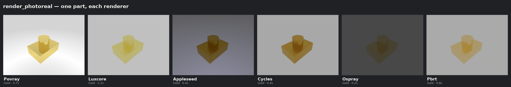
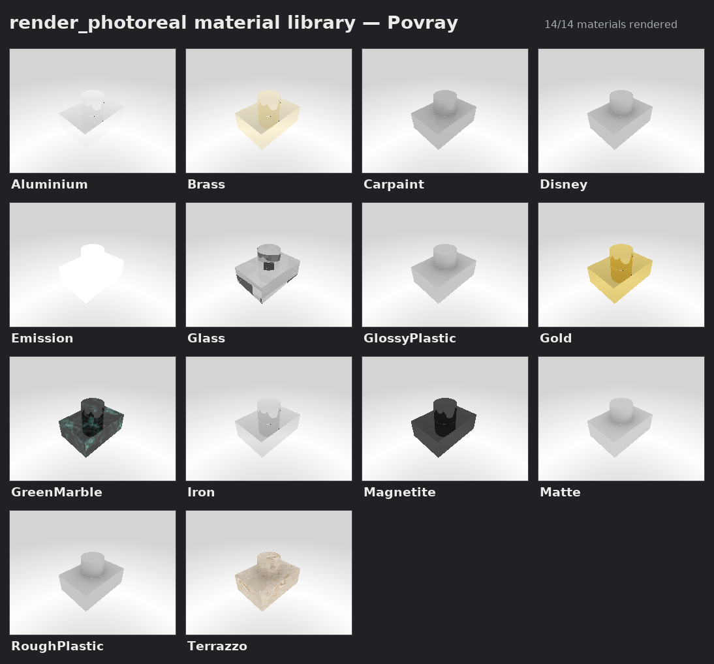
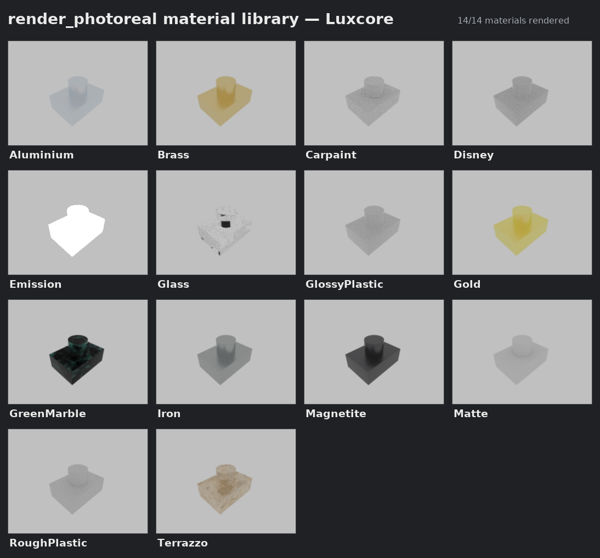
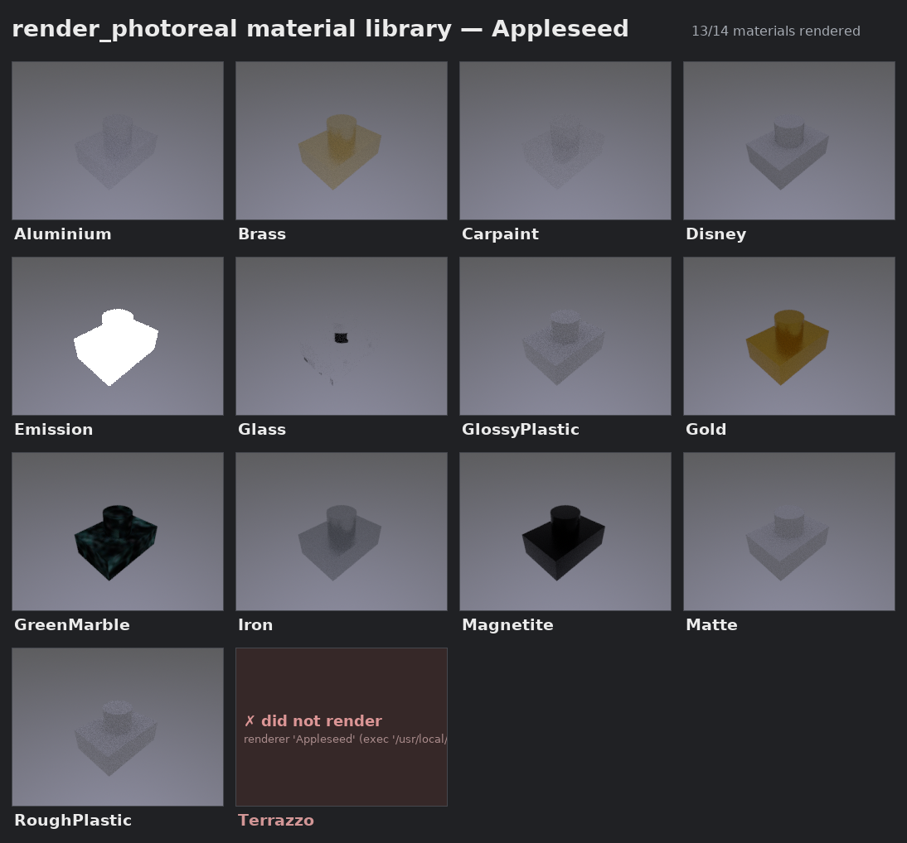
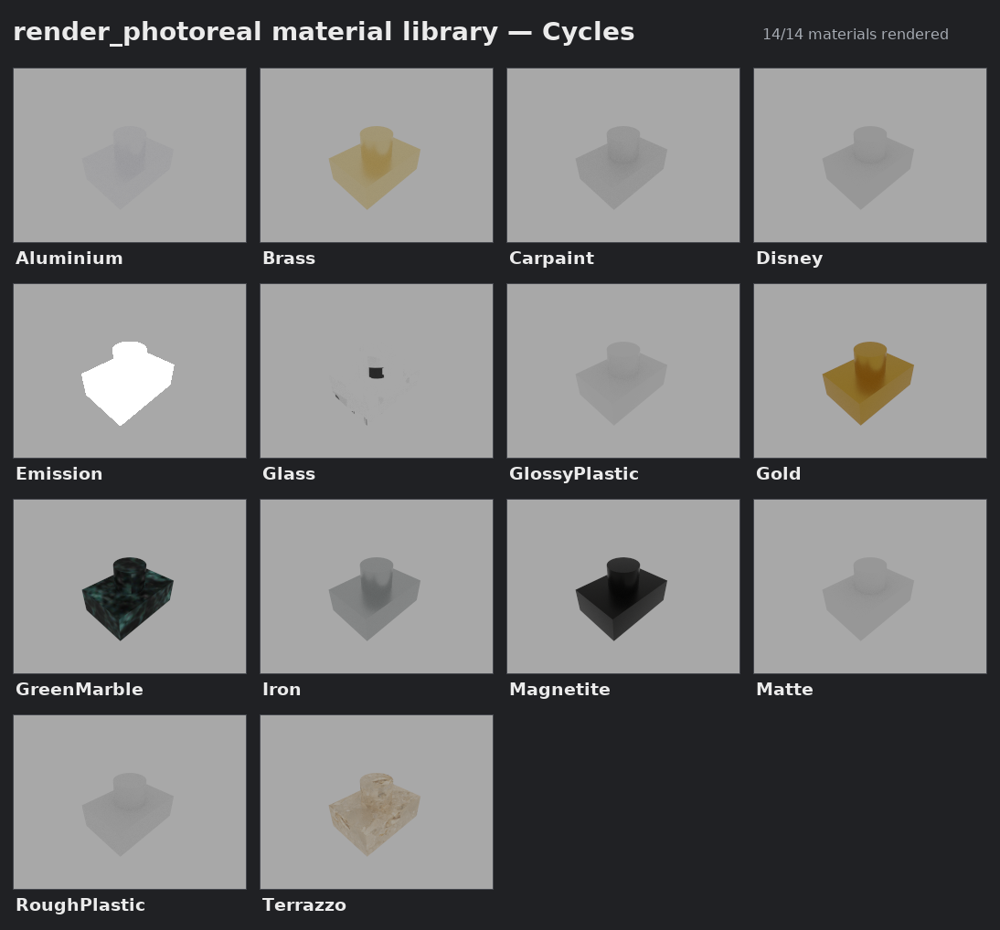
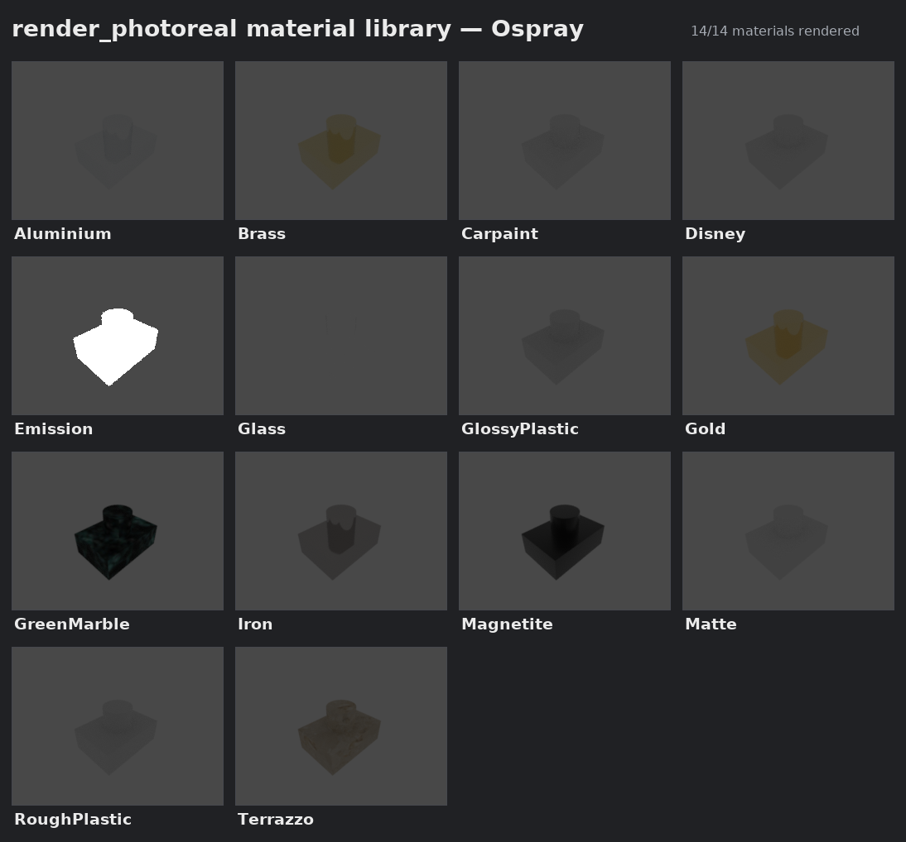
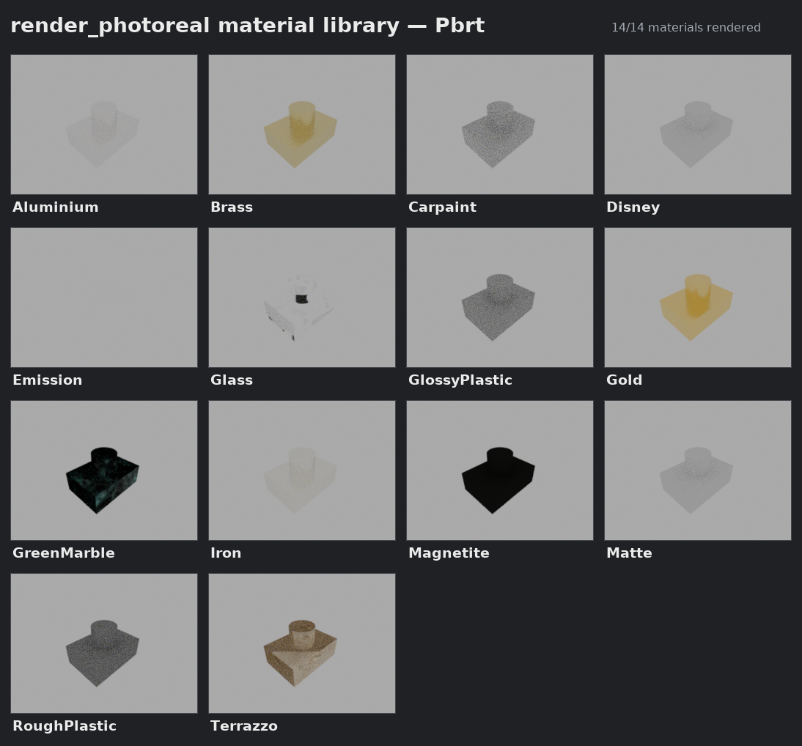

# Provisioning the external renderers

> For the user-facing support matrix, install instructions, and known limitations, start
> with [`RENDERING.md`](RENDERING.md). This doc is the provisioning detail behind it.


**Status: all six renderers provisioned on Linux x86_64.** The *code* side was done in
PR #18 (all six renderers wired into `driftpin/worker.py`'s `_RENDERERS` registry,
scene-export-verified headless). The prebuilt pair (Appleseed, LuxCore) ship via
`scripts/install-renderers.sh`; the three source-only renderers (pbrt-v4, Cycles,
OSPRay Studio) now build via `scripts/build-renderers.sh` (§7 item 3). On a fully
provisioned box `render_capabilities` reports all six available and the gated tests
PASS — except OSPRay, which renders correctly but below the non-blank threshold on the
addon's dim stock template (§4, and `RENDERING.md` known limitations).

Originally this doc added the two pieces §7 first called for:

- **`render_capabilities`** (MCP tool + `@handler`) — the agent now *discovers* which
  renderers resolve right now and whether the Render addon imports, instead of
  learning by trial-and-error. Done and tested (`test_render_capabilities`).
- **`scripts/install-renderers.sh`** — idempotent, checksum-verified installer for the
  prebuilt renderers; writes PATH wrappers (§3) that fix discovery *and* the bundled
  `LD_LIBRARY_PATH`. Verified end-to-end offline: install → wrapper → the resolver
  reports the renderer available via `render_capabilities`.

What changed vs. the original plan (binaries were re-checked against the real release
assets in June 2026 — see §4):

- Of the "three prebuilt" renderers, only **two** actually ship a usable headless CLI:
  **Appleseed** (`appleseed.cli`) and **LuxCore** — but LuxCore needs the **`-sdk`**
  tarball (the plain standalone ships only `luxcoreui` + `pyluxcore`; the console
  binary lives in the SDK), and v2.6 is the last release with a standalone build at all
  (newer releases are pip wheels). The script installs both.
- **OSPRay Studio has no prebuilt `ospStudio` binary** anywhere (no releases on
  `ospray_studio`; the OSPRay SDK tarball ships the library + examples, not Studio). It
  is therefore reclassified into the **build-from-source** group alongside pbrt-v4 and
  Cycles (§7).

So today, on a box with no extra binaries, `render_photoreal(renderer="Luxcore"|
"Appleseed"|"Cycles"|"Ospray"|"Pbrt")` still returns *"could not locate …"* and the
gated tests SKIP; POV-Ray (via `apt`) is the only one verified end-to-end. Run the
install script on a provisioned box to flip Luxcore/Appleseed SKIP → PASS. See also
[`RENDER_WORKBENCH.md`](RENDER_WORKBENCH.md) (architecture) and
[`RENDER_TEXTURE_CHECK.md`](RENDER_TEXTURE_CHECK.md).

> **Sandbox note.** Installing + wiring (download, checksum, unpack, wrapper, *discovery*)
> is verified here; **executing** a hand-fetched renderer is left to a trusted/provisioned
> environment (§8). The install script never runs the binaries.

All six renderers, same part + view + material, rendered through `render_photoreal` on
a fully provisioned box (POV-Ray via apt; LuxCore + Appleseed via
`scripts/install-renderers.sh`; Cycles + OSPRay + pbrt via `scripts/build-renderers.sh`):



OSPRay's panel is visibly darker than the others — its stock template lights the scene
with only a dim ambient light (see §4 and `RENDERING.md` known limitations); the geometry
and material are correct. Regenerate with `.venv/bin/python3 scripts/render-gallery.py` —
it renders whatever `render_capabilities` reports available.

### The full material library, per renderer

The original `docs/render_gallery.png` rendered every Render material card under POV-Ray
only. `scripts/render-material-gallery.py` does that grid for *each* available renderer
(one image per renderer), so the library can be compared across systems. A card that
fails on a renderer is shown as a marked cell, so the grid honestly reflects support.

| Renderer | Gallery | Materials rendered |
|---|---|---|
| POV-Ray   | `render_gallery_povray.png`    | 14 / 14 |
| LuxCore   | `render_gallery_luxcore.png`   | 14 / 14 |
| Appleseed | `render_gallery_appleseed.png` | 13 / 14 (the image-mapped **Terrazzo** card produces no output on the 2019 Appleseed build) |
| Cycles    | `render_gallery_cycles.png`    | 14 / 14 |
| OSPRay    | `render_gallery_ospray.png`    | 14 / 14 (all render, but dim — see the §4 note) |
| pbrt      | `render_gallery_pbrt.png`      | 14 / 14 |








Regenerate all: `.venv/bin/python3 scripts/render-material-gallery.py`
(or `--renderer Luxcore` for one).

---

## 1. How "available to the agent" resolves (read first)

The agent never references binaries directly. For `render_photoreal(renderer="X")`:

```
agent → MCP tool → worker handler → _resolve_renderer_exec("X")
       → proj.Proxy.render() → addon → Popen(<binary> …)   # inherits the worker's env
```

`_resolve_renderer_exec` (in `driftpin/worker.py`) finds the binary in this order and
then writes it into the FreeCAD param the plugin reads:

1. `DRIFTPIN_<RENDERER>_PATH` env var (e.g. `DRIFTPIN_LUXCORE_PATH`)
2. an exec path already set in FreeCAD prefs
3. **`PATH`** via `shutil.which`
4. per-OS standard dirs in the `_RENDERERS[...]["dirs"]` table

**Environment inheritance is the crux.** Neither `driftpin/client.py` (which spawns
`freecadcmd`) nor the Render addon's `RendererWorker` (which `Popen`s the renderer)
passes an explicit `env=`, so the renderer subprocess inherits the **worker's** env,
which inherits the **MCP server's** env. Therefore:

> Making a renderer "available to the agent" = making it discoverable by one of the
> four mechanisms above **in the environment that launches the MCP server**
> (`python -m driftpin mcp`). Setting it only in an interactive shell does nothing.

## 2. The two hurdles

1. **The binary.** POV-Ray was trivial (`apt` → on `PATH`, libs in system paths).
   The other five ship as **standalone builds** (or must be compiled).
2. **Bundled shared libraries.** The standalone tarballs carry their own `lib/` dir.
   `_resolve_renderer_exec` finds the binary but does **not** set `LD_LIBRARY_PATH`,
   so a *found* binary can still fail to launch. This must be handled at install time.

## 3. Recommended approach — wrapper scripts on `PATH`

One small wrapper per renderer solves discovery (mechanism #3) *and* the lib path,
with **zero code or MCP-config changes**. The wrapper name must match the
`binaries` tuple in `_RENDERERS` (table below):

```sh
# /usr/local/bin/luxcoreconsole   (chmod +x)
#!/bin/sh
export LD_LIBRARY_PATH="/opt/luxcore/lib:$LD_LIBRARY_PATH"
exec /opt/luxcore/luxcoreconsole "$@"
```

`shutil.which("luxcoreconsole")` finds the wrapper, libs load, the render runs.
Alternative (no wrapper): set `DRIFTPIN_<R>_PATH` to the real binary **and** export
`LD_LIBRARY_PATH` in the MCP server's launch env — but the wrapper is self-contained
and preferred.

## 4. Per-renderer facts (already wired in code) + where to get the binary

All five use **batch/headless mode** (already handled — `_RENDERERS[r]["batch"]=True`
makes the worker set `proj.BatchMode=True`). Param keys / binary names below are what
the addon plugins read and what the registry expects.

| Renderer (`renderer=`) | FreeCAD param | Binary name (wrapper) | Get it | Effort |
|---|---|---|---|---|
| `Appleseed` | `AppleseedCliPath` | `appleseed.cli` | **prebuilt** — appleseedhq/appleseed `2.1.0-beta` (2019, final build; `linux64-gcc74.zip`). Automated by `install-renderers.sh`. | easy |
| `Luxcore` | `LuxCoreConsolePath` | `luxcoreconsole` | **prebuilt SDK** — LuxCoreRender/LuxCore `v2.6` `linux64-**sdk**.tar.bz2` (the plain standalone lacks `luxcoreconsole`; v2.6 is the last standalone — newer = wheels). Automated by `install-renderers.sh`. | easy |
| `Ospray` | `OspPath` | `ospStudio` | **build from source** — `scripts/build-renderers.sh ospray`. No prebuilt `ospStudio` exists (the OSPRay SDK ships the lib, not Studio); we build `RenderKit/ospray-studio` against the prebuilt OSPRay 3.2.0 SDK. *Renders dim* on the addon's stock template (§ known limitations). | hard |
| `Pbrt` | `PbrtPath` | `pbrt` | **build from source** — `scripts/build-renderers.sh pbrt` (CMake; mmp/pbrt-v4 vendors its deps). Experimental upstream. | moderate |
| `Cycles` | `CyclesPath` | `cycles` | **build from source** — `scripts/build-renderers.sh cycles`. Blender's engine; CPU standalone built against **system libraries** (no Blender precompiled-lib bundle needed). | hard |

(POV-Ray, for reference: `PovRayPath` → `povray`, `apt install povray`.)

Pinned prebuilt assets (real SHA-256s, hardcoded in `scripts/install-renderers.sh`):

| Renderer | Asset | SHA-256 |
|---|---|---|
| Appleseed | `appleseed-2.1.0-beta-0-g015adb503-linux64-gcc74.zip` | `e96fc907fa95b38c7be542b796fd783870da67612eb233bd4965c2ebec7335d2` |
| LuxCore | `luxcorerender-v2.6-linux64-sdk.tar.bz2` | `c4a387ee65765b235d47c81c83e293ff584bd4da4b5e24fc89d651c8c1393393` |

Each plugin's exact exec/batch handling is in
`<App.getUserAppDataDir()>/Mod/Render/Render/renderers/<Renderer>.py` if details are
needed; the `install_hint` strings in `_RENDERERS` already capture the gist.

## 5. Making it available to the agent specifically

Pick one and apply it to the **MCP server launch env**:

- **PATH wrappers (recommended):** drop the §3 wrappers in a dir on the MCP server's
  `PATH`. Nothing else to configure.
- **MCP client config `env` block:** if the agent launches the server via an MCP
  config (Claude Desktop/Code `mcpServers` entry), set `DRIFTPIN_<R>_PATH` and
  `LD_LIBRARY_PATH` there so the spawned server (and its worker) inherit them.
- **Service/shell env:** if the server runs from a shell or unit file, export the
  vars there.

## 6. Verification

- **Discovery check (no binary needed, never skips):** `render_capabilities` (MCP tool)
  reports `addon_importable` plus, per renderer, `available` + the resolved `path` (or an
  `install_hint`). This is the fast "what's usable right now" probe — run it before and
  after the install script to watch renderers flip to `available: true`. It resolves the
  binary exactly as `render_photoreal` does but renders nothing and mutates no prefs.
- **Pre-check without the binary (wiring only):** the addon's DryRun mode renders the
  scene files but skips the binary — used in PR #18 to confirm each renderer emits a
  valid scene. Good for sanity before a real install.
- **Real check (the source of truth):** `.venv/bin/python3 tests/test_render_photoreal.py`.
  Each renderer's gated test flips **SKIP → PASS** once its binary resolves
  (`test_photoreal_{luxcore,appleseed,cycles,ospray,pbrt}_renders`).
- **Agent check:** `render_photoreal(handle, renderer="X")` returns a PNG instead of
  "could not locate". A montage like `docs/render_gallery.png` can be regenerated to
  compare renderers side by side.

## 7. Work items

1. ✅ **`scripts/install-renderers.sh`** — done. Fetches the prebuilt renderers into
   `$PREFIX/<renderer>/` (default `/opt`), verifies pinned SHA-256s, and writes the §3
   wrappers to `$BINDIR` (default `/usr/local/bin`). Idempotent; `--list` shows status;
   macOS/Windows print guidance (follow-ons). **Scope correction:** only Appleseed +
   LuxCore (`-sdk`) have usable prebuilt CLIs (§4); OSPRay Studio has no prebuilt and
   moved to item 3.
2. ✅ **`render_capabilities` MCP tool** — done. Worker `@handler` + `@mcp.tool()` (parity
   per `tests/test_contracts.py`), tested by `test_render_capabilities`. Reports per-renderer
   availability + addon import status + material cards, side-effect-free.
3. ✅ **OSPRay Studio + pbrt-v4 + Cycles from source** — done via
   `scripts/build-renderers.sh` (companion to the prebuilt installer; same wrapper-on-PATH
   discovery contract, §3). Idempotent; `--list` shows status; `--deps-only` just
   apt-installs build deps. Built + verified end-to-end on Ubuntu 24.04 x86_64 (gcc 13,
   CMake 3.28). The proven recipes:
   - **pbrt-v4** (moderate) — `git clone --recursive mmp/pbrt-v4`, then
     `cmake -G Ninja -DCMAKE_BUILD_TYPE=Release` and `ninja pbrt imgtool`. Vendors its own
     deps (OpenEXR, Ptex, …); CUDA auto-skipped → CPU build. Links only system libs, so the
     PATH wrapper just execs (no `LD_LIBRARY_PATH`). Renders cleanly (test PASS).
   - **Cycles** (hard) — `git clone --branch v4.2.0 blender/cycles`, **`rm -rf lib`** (the
     repo carries empty `lib/linux_x64` submodule placeholders whose mere existence flips
     Cycles' CMake into precompiled-lib mode and makes it ignore system paths → spurious
     "Could NOT find ZLIB"). Then build the **CPU standalone against system libraries**:
     `-DWITH_CYCLES_STANDALONE=ON -DWITH_CYCLES_STANDALONE_GUI=OFF` plus turn off the deps
     Ubuntu doesn't package or that we don't need:
     `-DWITH_CYCLES_OSL=OFF -DWITH_CYCLES_USD=OFF -DWITH_CYCLES_HYDRA_RENDER_DELEGATE=OFF`
     `-DWITH_CYCLES_OPENSUBDIV=OFF -DWITH_CYCLES_OPENIMAGEDENOISE=OFF -DWITH_CYCLES_ALEMBIC=OFF`
     `-DWITH_CYCLES_PATH_GUIDING=OFF -DWITH_CYCLES_NANOVDB=OFF`
     `-DWITH_CYCLES_DEVICE_CUDA=OFF -DWITH_CYCLES_DEVICE_OPTIX=OFF -DWITH_CYCLES_DEVICE_HIP=OFF`
     (keep `-DWITH_CYCLES_EMBREE=ON -DWITH_CYCLES_OPENVDB=ON`). apt deps: OpenImageIO,
     OpenColorIO, Embree4, OpenEXR, TBB, Boost, pugixml, OpenVDB, blosc, png/jpeg/tiff.
     Binary lands at `build/bin/cycles`; links only system libs. Renders cleanly (test PASS).
   - **OSPRay Studio** (hard) — download Intel's prebuilt **OSPRay 3.2.0 SDK**
     (`ospray-3.2.0.x86_64.linux.tar.gz`, bundles Embree/OpenVKL/rkcommon/TBB/OIDN), then
     `git clone --recursive RenderKit/ospray-studio` (archived; master == v1.1.0, whose
     CMake pins OSPRAY_VERSION 3.2.0 — matches) and configure with
     `-DCMAKE_PREFIX_PATH=<sdk> -DBUILD_TESTING=OFF`. `find_package(ospray)` resolves from
     the SDK (it's self-contained, `OSPRAY_INSTALL_DEPENDENCIES`); Studio FetchContent-builds
     its own *static* rkcommon + TBB (it anticipates the clash with the SDK's shared
     rkcommon). `ninja ospStudio` (needs `libglfw3-dev`; the binary is monolithic but its
     `batch` subcommand runs headless — no DISPLAY). Install the binary + `libospray_sg.so` +
     the SDK's `lib/*.so*` into `$PREFIX/ospray_studio/{bin,lib}` and write a wrapper that
     sets `LD_LIBRARY_PATH=$PREFIX/ospray_studio/lib`. ⚠️ **Caveat:** the addon's stock
     `ospray_standard.sg` lights the scene with a single dim ambient light
     (`color [0.2,0.2,0.2]`), so OSPRay's image is correct but low-contrast — it does *not*
     clear the gated test's non-blank threshold (std > 3). This is an addon-template trait,
     not a build defect (the same scene renders bright on the other five). See
     `RENDERING.md` known limitations.

Pinned source revisions (hardcoded in `scripts/build-renderers.sh`):

| Source | Pin | SHA-256 |
|---|---|---|
| pbrt-v4 (mmp/pbrt-v4) | commit `7154d82` | — (git) |
| Cycles (blender/cycles) | tag `v4.2.0` | — (git) |
| OSPRay Studio (RenderKit/ospray-studio) | commit `686ceff` (archived master) | — (git) |
| OSPRay SDK | `ospray-3.2.0.x86_64.linux.tar.gz` | `d8670e69b4762e24f2aa83629af897e8f33ea1c724e17e613942c0ccc1c723be` |
4. ⬜ **Dockerfile (optional)** — an image with all renderers + libs baked in. Most
   reproducible "make them available" path; sidesteps `LD_LIBRARY_PATH` entirely and is
   the natural home for a CI lane that exercises real renders.

### Optional code hardening (only if wrappers prove insufficient)
- Teach `_resolve_renderer_exec` to also set `LD_LIBRARY_PATH` from a registry
  `lib_dirs` field (removes the need for wrappers), **or** generate the wrappers.
- Have the worker pass an explicit `env=` to the render subprocess rather than relying
  on inheritance (more predictable; larger change — touches the addon boundary).

## 8. Risks & open questions

- **CI placement.** Real renders need the binaries; the hosted nightly lane has no
  renderer and the render tests already skip there (and need Pillow + the two-interp
  `.venv`). Put a real-render lane on the self-hosted box (where POV-Ray already runs),
  or behind a renderer-provisioned Docker job. Don't gate the main suite on it.
- **Binary size / storage.** Each standalone is ~100–250 MB. Don't commit them; fetch
  in the install script / Docker build. Pin versions + checksums.
- **Licensing.** Confirm redistribution terms before baking binaries into an image.
- **Determinism.** Already settled — photoreal output is presentation-only and stays
  out of the reliability/golden tests. The new lane asserts invariants (non-blank,
  per-renderer), not pixels.
- **Upstream maturity.** pbrt-v4 support is flagged experimental in the addon, and the
  addon itself is unmaintained (see `RENDER_WORKBENCH.md` §2). Cycles has no standalone
  CLI shipped — the build is non-trivial. Budget accordingly.
- **Sandbox caveat.** In an agent sandbox the classifier may block *executing* a
  hand-fetched binary (untrusted external code). Installing/wiring is fine; the final
  render needs a trusted/provisioned environment.

## 9. Files this work touched

- ✅ `scripts/install-renderers.sh` (new) — writes wrappers to `$BINDIR` (default
  `/usr/local/bin`) and installs under `$PREFIX` (default `/opt`). The *prebuilt* pair.
- ✅ `scripts/build-renderers.sh` (new) — the *source-built* trio (pbrt-v4, Cycles,
  OSPRay Studio). Same `$PREFIX`/`$BINDIR` wrapper contract; `--list`, `--deps-only`,
  pinned revisions + the OSPRay SDK checksum. Item 3, above.
- ✅ `scripts/render-gallery.py` + `docs/render_renderers_gallery.png` — the example
  montage above, regenerated across all six available renderers.
- ✅ `scripts/render-material-gallery.py` + `docs/render_gallery_{povray,luxcore,appleseed,cycles,ospray,pbrt}.png`
  — the material library rendered as a grid per renderer (now all six).
- ✅ `driftpin/worker.py` — added `@handler("render_capabilities")`; refactored
  `_resolve_renderer_exec` to share a side-effect-free `_find_renderer_exec` the probe
  reuses. The `_RENDERERS` registry was already complete (unchanged).
- ✅ `driftpin/mcp_server.py` — added the `render_capabilities` tool.
- ✅ `tests/test_render_photoreal.py` — added `test_render_capabilities` (a pure probe,
  so it never skips). The gated renderer tests still SKIP until binaries land on a box.
- ⬜ `docs/` — `RENDER_WORKBENCH.md` notes the new tool + script; deeper §6/§7 updates and
  a Docker/CI note wait until a provisioned box verifies a real Luxcore/Appleseed render.

### Code hardening NOT needed (wrappers sufficed)
The §3 wrappers handle `LD_LIBRARY_PATH` per renderer, so the optional resolver/`lib_dirs`
or explicit-`env=` changes were not required. Revisit only if a wrapper-less path is wanted.
