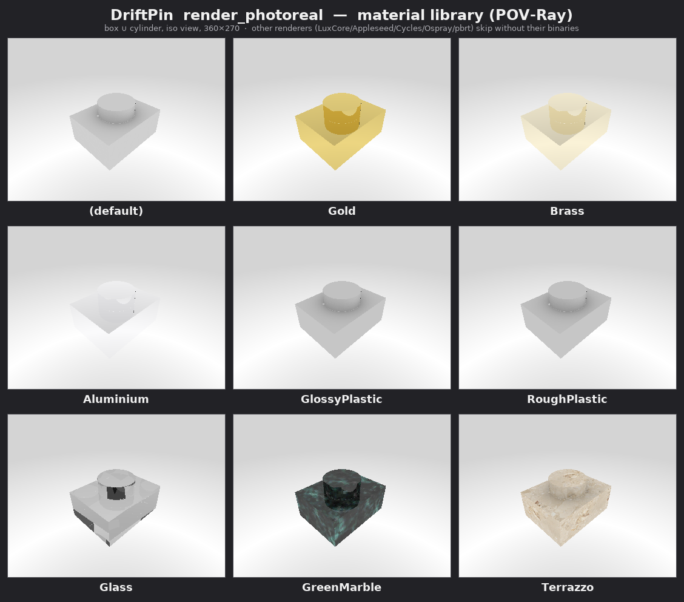

# Photoreal rendering via the FreeCAD Render workbench

AnkusDrive grows a *photorealistic* render path by stitching in the third-party
[FreeCAD Render workbench](https://github.com/FreeCAD/FreeCAD-render) and exposing
it as an MCP tool (`render_photoreal`) alongside the existing software-rasterized
[`render_view`](../ankusdrive/render.py).

> This is the architecture / design record. For the user-facing **support matrix,
> installation, verification, and limitations**, see [`RENDERING.md`](RENDERING.md).

**Status: Phase 1 implemented.** `render_photoreal` is wired end-to-end through the
worker and the MCP server, verified on Linux with FreeCAD 1.1.0 + POV-Ray 3.7.
The addon and a renderer binary are still *optional at runtime* — AnkusDrive boots
and runs without them, and the tool returns clear install guidance if they are
absent (the renderer-gated tests skip rather than fail). It supports the Render
addon's material library (the `material` argument — Gold, Glass, Aluminium, …), a
all five other renderers the addon supports (LuxCore, Appleseed, Cycles, Ospray,
pbrt-v4 via `renderer=`), and a non-blocking job API (`render_photoreal_submit` +
`render_job`, with `discard` + auto-eviction) for long renders. The few remaining
follow-ups (POV-Ray texture maps; the upstream fork decision) are tracked in §7. This
doc doubles as the design record and the operator's install guide for all three platforms.

---

## 1. Why, and what we have today

AnkusDrive's original render path is a deliberate "can the agent *see* what it just
built?" tool, not a presentation tool:

- `render_view` / `render_views` (MCP) → worker `tessellate` handler returns
  vertices + triangles → host-side [`render.py`](../ankusdrive/render.py)
  rasterizes in pure NumPy + Pillow.
- Flat Lambertian shading, orthographic, fixed light, per-pixel z-buffer. No
  materials, no GI, no perspective. Fast, deterministic, zero external deps.

That's the right tool for closed-loop reliability checks (Layer A/D). It is the
wrong tool for "show me a nice picture of the part." Photoreal output (materials,
lighting, global illumination, perspective camera) is a separate concern and is a
separate tool — `render_photoreal`, **not** a flag on `render_view`.

## 2. Maintenance status of the upstream workbench — read this first

The Render workbench is **frozen / in maintenance limbo**:

- The maintainer **Howetuft announced discontinuation on 2025-11-12**
  ("I am discontinuing maintenance of this workbench as of now") and is seeking a
  successor. None has stepped up.
- As of mid-2026: ~226★, ~3,900 commits, issues still filed (people use it; nobody
  merges). Still listed in the official FreeCAD Addon Manager and still functional.

**Implication for us:** it is safe to *consume* (we depend on a stable Python API,
not on a roadmap) but risky *long-term*. The concrete failure mode is FreeCAD 1.1 /
2.0 eventually drifting out from under it with nobody upstream to patch — the same
class of breakage we already track for FreeCAD API drift. We therefore **pin a
known-good commit** rather than tracking `master`, and treat the integration as
something we may have to fork or re-host.

> **Pinned commit:** `08be2fe94b8a998323c8a5443f7f0afd0d05bed5` (2026-05-16),
> verified against FreeCAD 1.1.0. Bump deliberately, re-run the photoreal tests.

## 3. How the workbench works (architecture)

It is a **pure-Python workbench**. The entire scene — `Project`, `Camera`, `View`,
lights, materials — is a graph of FreeCAD `App` document objects. On render it
serializes that graph into a renderer-specific scene file and **shells out to an
external renderer binary**:

| Renderer | Install (Linux / macOS / Windows) | Notes |
|---|---|---|
| POV-Ray | `apt install povray` / `brew install povray` / official installer | **Default.** Single CLI binary, deterministic-ish, easiest. Lower photoreal ceiling. |
| LuxCoreRender | hand-fetched standalone (provides `luxcoreconsole`) | **Supported** (`renderer="Luxcore"`, batch/console mode). Highest quality + PBR materials; heavier/slower headless. |
| Appleseed | hand-fetched build (provides `appleseed.cli`) | **Supported** (`renderer="Appleseed"`, batch/console mode). |
| Cycles (standalone) | hand-fetched `cycles` CLI | **Supported** (`renderer="Cycles"`, batch adds `--background`). Blender's engine. |
| Ospray | hand-fetched OSPRay Studio (`ospStudio`) | **Supported** (`renderer="Ospray"`, batch subcommand). |
| pbrt-v4 | hand-fetched `pbrt` | **Supported** (`renderer="Pbrt"`, batch/headless). pbrt-v4 marked experimental upstream. |

The workbench itself rasterizes nothing — **it's a scene exporter + process
launcher.** That is exactly what makes it embeddable in AnkusDrive's worker, given
that we can drive it without the GUI.

**Public Python API — as actually observed (the original proposal mis-stated
several of these; corrected here):**

```python
# create() returns a 3-TUPLE (proxy, fpo, viewprovider) — NOT the object.
proj_proxy, proj, _ = Render.Project.create(doc, renderer="Povray",
                                             template="povray_standard.pov")
proj.RenderWidth, proj.RenderHeight = 800, 600   # REQUIRED: render() aborts if <= 0

cam_proxy, cam, _ = Render.Camera.create(doc)    # also a 3-tuple
cam.Projection = "Perspective"
cam.Placement  = ...                              # camera->world placement

proj_proxy.add_views([cam, part])                 # camera + part are both "views"
img = proj.Proxy.render(wait_for_completion=True) # -> output image path (or None)
```

Corrections vs. the original proposal:

- **`Project.create` / `Camera.create` return `(proxy, fpo, viewprovider)`**, so you
  must unpack. `proj.Proxy.render(...)` (equivalently `proj_proxy.render(...)`) is
  the render entry point.
- **A template is effectively required.** With no `template=`, `Project.Template`
  is empty and `render()` fails (`Is a directory: '.../templates/'`). We pass a
  shipped template (`povray_standard.pov`). `Template` is a relative filename
  resolved against the addon's `templates/` dir.
- **`RenderWidth` / `RenderHeight` must be set** on the project fpo — resolution is
  *not* an argument to `render()`.
- The output path defaults to `{Document.TransientDir}/{Name}_output.png`; `render()`
  returns it. (We never set `OutputImage`.)

## 4. The headless question (resolved)

AnkusDrive's worker runs inside `freecadcmd` — **no GUI, `App.GuiUp == False`**.
Photoreal rendering works headless; the three GUI-coupled behaviors are handled by
building scene state as `App` objects instead of borrowing it from a viewport:

| Concern | With GUI | Headless — what AnkusDrive does |
|---|---|---|
| **Camera** | grabs `Gui.ActiveDocument.ActiveView.getCamera()` | No viewport → **adds an explicit `Camera` object and sets its `Placement`** via [`_placement_from_view`](../ankusdrive/worker.py) (pure `App.Vector` math mirroring `render.py`'s `_camera_basis`; see below). |
| **Visibility filter** | renders only views with `ViewObject.Visibility` | Falls back to **all** views. No action needed. |
| **Materials / colors** | reads `ViewObject.ShapeColor` etc. | No ViewObject colors → the optional `material` argument applies a real Render `Material` from the library (§5.1); omitted falls back to the **default material**. |

Two harmless headless artifacts worth knowing:

- **"More than one camera" POV-Ray warning.** The workbench always injects a default
  camera *and* emits our explicit camera; POV-Ray uses the last one, which is ours
  (it lands in `RaytracingContent`, after the template's `RaytracingCamera` line), so
  our `view=` wins. Verified by rendering the same part from `iso`/`front`/`top` and
  confirming the images differ.
- **SSL / virtualenv traceback on import.** On `import Render`, a background thread
  tries to bootstrap a Python venv over the network (for optional features). In a
  sandboxed/offline environment it fails with an SSL error and the thread dies — it
  is non-fatal and never reaches stdout (worker stderr is discarded), so the JSON
  protocol is unaffected.

### Reuse note (corrects the proposal)

The proposal said to "reuse `render.py`'s `_VIEWS` / `_camera_basis`." That is **not
importable** from the worker: `render.py` is a host-side NumPy/Pillow module, and the
`freecadcmd` worker imports only `FreeCAD`/`Part`/`ObjectsFem`/`Sketcher`. So the
worker carries its own pure-`App.Vector` copy of the view table (`_RENDER_VIEWS`) and
camera math (`_placement_from_view`), kept deliberately identical to `render.py`'s
basis so the two render paths frame a part the same way.

## 5. Implemented integration

Photoreal rendering runs **inside the FreeCAD process** (it needs the live document
and the `Render` package), so it is a worker handler, not a change to `render.py`.

The whole material library rendered through `render_photoreal` (one part, iso view,
POV-Ray):



(Regenerate with the gallery script; only POV-Ray is in the sandbox, so the other
renderers in §3 would need their binaries.)

### 5.1 Worker handler — [`ankusdrive/worker.py`](../ankusdrive/worker.py)

`@handler("render_photoreal")` (plus helpers `_placement_from_view`,
`_resolve_renderer_exec`, and the `_RENDER_VIEWS` / `_RENDERERS` tables). Key design
decisions beyond the API corrections in §3:

- **Temp-document isolation.** The handler copies the target shape into a throwaway
  `App` document, builds the Project/Camera/View graph *there*, renders, reads the
  PNG, and closes the temp doc — restoring the previously active document. The user's
  live model is never mutated and no Render objects leak into their saved `.FCStd`.
  (Trade-off: it renders the *shape*, so any ViewObject colors are dropped — which
  headless has none of anyway, per §4. Materials are applied explicitly instead;
  see below.)
- **Materials.** The optional `material` argument names a Render material library
  card (e.g. `Gold`, `Glass`, `Aluminium`, `GlossyPlastic`). `_apply_render_material`
  parses the `.FCMat` card (the same flattened-configparser read the addon's material
  chooser uses), creates a Render `Material` object, imports any image textures, and
  links it via the render target's `View.Material`. Omitting it keeps the neutral
  default; an unknown name raises with the list of available cards. `_available_render_materials`
  enumerates them from the addon's `materials/` dir.
- **Cross-platform renderer resolution.** `_resolve_renderer_exec` finds the binary
  via, in order: `ANKUSDRIVE_<RENDERER>_PATH` env override → path already set in FreeCAD
  prefs → `PATH` (`shutil.which`, which honors Windows `PATHEXT`) → common per-OS
  install dirs (`platform.system()`-keyed). It then writes the path into the FreeCAD
  param the plugin reads. **The param key is `PovRayPath` in group
  `User parameter:BaseApp/Preferences/Mod/Render`** — *not* `RenderExecPath` as the
  proposal claimed, and the plugin does *not* fall back to `PATH`, so AnkusDrive must
  set it.
- Returns `{png_base64, png_path, renderer, view, material, width, height}`.

### 5.2 MCP tool — [`ankusdrive/mcp_server.py`](../ankusdrive/mcp_server.py)

```python
@mcp.tool()
def render_photoreal(handle, renderer="Povray", view="iso",
                     material=None, width=800, height=600):
    """Photorealistic render via the FreeCAD Render workbench (external renderer).
    Returns {png_base64, png_path, renderer, view, material, width, height}."""
    return _call("render_photoreal", _timeout=600.0,
                 handle=handle, renderer=renderer, view=view,
                 material=material, width=width, height=height)
```

- **Worker-call timeout raised to 600 s for this (blocking) call.** `Worker.call`
  defaults to a 120 s timeout (`client.py`); an external render legitimately takes
  seconds to minutes, and hitting that default raises `WorkerDied` and respawns a
  fresh worker, destroying the live document. `_call` now threads an optional
  `_timeout`, and `render_photoreal` passes 600 s.

### 5.3 Async jobs — `render_photoreal_submit` + `render_job`

For renders that may exceed even 600 s — or simply to keep the worker responsive — a
non-blocking job API runs alongside the blocking `render_photoreal`:

- `render_photoreal_submit(...)` (same args) builds the scene synchronously and calls
  `proj.Proxy.render(wait_for_completion=False)`, then returns `{job_id, status:
  "running"}` immediately. `render_job(job_id)` polls → `{status: "running"}`, or when
  finished `{status: "done", png_base64, …}` / `{status: "failed", error}`.
- **Why this is thread-safe.** Headless, the workbench's executor is `RendererExecutorCli`
  — a plain `threading.Thread` that runs *only* the renderer subprocess. The FreeCAD
  scene export already happened in the calling thread *before* the thread starts, so
  the background thread never touches the (non-thread-safe) FreeCAD document model. The
  worker's main loop is free to serve other tool calls while the render runs (verified:
  `ping` succeeds mid-render).
- **Temp-doc lifetime.** Unlike the blocking path, the job keeps its temp document open
  until the result is collected — the renderer reads exported scene files from the doc's
  `TransientDir`. `render_job` closes the doc and caches the PNG once the render finishes.
  Jobs persist for the worker session (like object handles); the result survives repeat
  polls. The submit handler restores the previously-active document so the live session
  is unaffected.
- Completion is detected from the executor thread (`is_alive()`), captured by diffing
  `threading.enumerate()` across the launch, with output-file existence as a fallback.
- **Lifecycle / memory.** `render_job(job_id, discard=True)` frees a finished job on
  demand (closes its temp doc, drops the cached PNG). As a backstop, finished jobs are
  auto-evicted oldest-first once they exceed an internal cap (`_MAX_RENDER_JOBS`, 16);
  running jobs are never evicted.

## 6. Prerequisites (cross-platform)

1. **Install the addon** into the Mod dir FreeCAD actually reads. Don't hardcode it —
   derive it from `App.getUserAppDataDir()` (it honors `$XDG_DATA_HOME` on Linux), so
   the path varies by platform and even by shell sandbox:
   - Linux: `~/.local/share/FreeCAD/Mod/Render` (or `$XDG_DATA_HOME/FreeCAD/Mod/Render`)
   - macOS: `~/Library/Application Support/FreeCAD/Mod/Render`
   - Windows: `%APPDATA%\FreeCAD\Mod\Render`
   ```bash
   git clone https://github.com/FreeCAD/FreeCAD-render \
     "$(<derived Mod dir>)/Render"
   git -C "<…>/Render" checkout 08be2fe94b8a998323c8a5443f7f0afd0d05bed5   # pin
   ```
   (or Addon Manager → "Render", then check out the pinned commit.)
2. **Install one renderer binary** — POV-Ray for Phase 1:
   `apt install povray` (Linux) · `brew install povray` (macOS) · official installer (Windows).
   For the alternate renderers, `scripts/install-renderers.sh` provisions the prebuilt
   ones (Appleseed, LuxCore) with pinned-checksum downloads + PATH wrappers; see
   [`RENDER_RENDERER_INSTALL.md`](RENDER_RENDERER_INSTALL.md) (OSPRay Studio, pbrt, Cycles
   need a source build).
3. **Nothing else** — AnkusDrive resolves the binary and sets `PovRayPath` itself (§5.1).
   Override with `ANKUSDRIVE_POVRAY_PATH=/full/path/to/povray` if it lives somewhere odd.
   Call the `render_capabilities` MCP tool any time to see which renderers resolve right
   now (and whether the addon imports) without attempting a render.

## 7. Resolved decisions & remaining follow-ups

Resolved (were open questions in the proposal):

- **Determinism.** Photoreal renders are not bit-reproducible, so `render_photoreal`
  stays *out* of the reliability/golden tests — it is presentation-only. Its tests
  ([`tests/test_render_photoreal.py`](../tests/test_render_photoreal.py)) assert
  invariants (valid PNG, non-blank, `view=` changes the image, a `material=` card
  changes the color, unknown material errors cleanly, live doc untouched).
- **CI.** The tests **skip** when the addon/binary is absent (exit 0), so they're safe
  everywhere; they only do real work on a box that provisions a renderer. They run in
  the self-hosted suite (`tests/run_all.sh`), alongside `test_render.py` — *not* the
  hosted nightly, which has neither Pillow nor a renderer.
- **Worker blocking.** Resolved (§5.3). `render_photoreal_submit` + `render_job` give a
  non-blocking job API — the external renderer runs in the workbench's headless
  `threading.Thread`, the worker stays responsive (verified: `ping` mid-render), and
  there is no hard time ceiling. Blocking `render_photoreal` (600 s cap) stays for the
  common quick-render case.
- **Renderer choice.** The handler is renderer-agnostic: adding one is a single entry
  in the `_RENDERERS` registry (param key, default template, binary names, per-OS dirs,
  optional `batch` flag, install hint). **All six the addon supports are wired** —
  POV-Ray (default) plus LuxCore, Appleseed, Cycles, Ospray, and pbrt-v4; unknown
  renderers raise with clear, per-renderer guidance. The five hand-fetched renderers run
  headless in batch mode (console binary, `--background`, or a `batch` subcommand as each
  requires). Each one's scene export + material translation are verified headless via the
  addon's DryRun (e.g. a Gold box emits valid LuxCore SDL — `scene.materials … type =
  metal2`; Appleseed `<assembly>`/`<material>` XML; Cycles `<shader>`/`<camera>` XML;
  pbrt `Material "conductor"`; Ospray `.sg` scene graph); the external binaries themselves
  run on a provisioned box / CI rather than the sandbox, on the same code path POV-Ray is
  verified end-to-end on.
- **Materials.** Implemented — the `material` argument applies any of the addon's
  library cards (metals, glass, plastics, marble, …) via `View.Material`, verified
  visually (Gold renders yellow) and in tests. The card-driven `[Render]` sections are
  renderer-agnostic, so this carries to other renderers as they're added.
- **Textured materials under POV-Ray.** Confirmed — the two image-mapped cards
  (`GreenMarble`, `Terrazzo`) render their **colour** maps under POV-Ray (normal /
  displacement maps are dropped, a POV-Ray-plugin limitation). Verified visually
  2026-06-04; the repeatable procedure + pass criteria live in
  [`RENDER_TEXTURE_CHECK.md`](RENDER_TEXTURE_CHECK.md). *Follow-up:* an optional
  automated colour-variance proxy to regression-guard it (described in that runbook).
- **Job lifecycle.** Resolved (§5.3): `render_job(discard=True)` frees a finished job on
  demand, and finished jobs are auto-evicted past a cap, so the session stays bounded.

Remaining follow-ups (not yet implemented):

- **User-supplied materials.** Colours / PBR parameters beyond the shipped library cards.
- **Upstream risk.** Decide if/when to fork or re-host the unmaintained addon, and what
  FreeCAD version range we commit to supporting (§2).

## 8. Future directions (proposed, not committed)

Larger design directions that build *on top of* the shipped foundation (§5:
`render_photoreal` + material-library cards + `render_capabilities`). These were
sketched in the original pipeline proposal (PR #16, closed as superseded once the
implementation diverged); they are preserved here as directions to weigh later, not
as plans. The unifying principle is unchanged: **the agent speaks intent, never
renderer syntax** — no POV-Ray finishes or LuxCore node graphs cross the tool boundary.

- **Intent-based `render_scene` (scene + quality presets).** Today the agent picks
  `renderer` / `view` / `material` / size and inherits whatever lighting the addon's
  per-renderer template ships. A higher-level `render_scene(target, scene=…, quality=…)`
  would layer over `render_photoreal` and let the agent name a *situation* instead:
  - `scene` — a small set of renderer-neutral lighting/environment setups, each realized
    as a workbench template + Light objects + groundplane + environment, e.g. `studio`
    (soft 3-point key/fill/rim on a seamless backdrop), `workshop` (even matte spec
    look), `outdoor` (sun + sky), `hdri` (image-based lighting from an `.hdr`),
    `xray`/`section` (semi-transparent or cutaway).
  - `quality` — a time budget (`draft` → `preview` → `final`) mapping to
    samples / denoise / resolution-scale; the returned `samples` / `elapsed_s` let the
    agent learn the trade-off and decide whether to re-render larger.
  `render_capabilities` would grow to advertise the scene + quality menu (it already
  advertises renderers + material cards), so the agent introspects the options instead
  of guessing. **Note:** a proper `studio`/`workshop` scene also subsumes the current
  OSPRay limitation — the stock `ospray_standard.sg` lights with only a dim ambient
  light, and these scenes would add the directional/area lighting it lacks (see
  [`RENDERING.md`](RENDERING.md) known limitations).

- **Per-component CMF (Color / Material / Finish) via `set_appearance`.** Materials are
  applied today from the addon's library cards at render time (`material=`). A
  `set_appearance(handle, material=…, color=…, metallic=…, roughness=…, finish=…)` would
  instead attach a **renderer-neutral material object** (`App::MaterialObjectPython`,
  headless-creatable) that **persists in the `.FCStd`** — so appearance travels with the
  part and `merge_assembly` preserves each component's look automatically, no central
  re-skin. Two authoring modes: *builder-owned* (each component agent sets its own CMF,
  fits the cold-builder model in [`MULTI_AGENT.md`](MULTI_AGENT.md)) and *coordinator
  art-direction* (`cmf_overrides={component_id: {…}}` applied to the merged instances at
  render time, e.g. "all brackets anodized black"). Open trade-off (the shipped path
  chose library cards — §7): adopt the WB card names as the contract, or define our own
  neutral PBR schema and translate. `set_appearance` would *extend* the card path, not
  replace it.

- **Assembly rendering.** `render_photoreal` renders a single handle. Rendering a whole
  merged assembly — as one combined hero image and/or per-component contact sheets — is
  the natural pairing with per-component CMF, and the point where the render path meets
  the multi-agent assembly flow.
